Hadoop基础

### 一. Hadoop概述

#### 1.1 为什么要用Hadoop

我们生活在数据大爆炸的年代，2020年达到84.5ZB，比预计的61ZB整整多出20+ZB，在疫情时期，数据达到空前爆发式增长，单位换算后在840亿TB以上，也就是全球每人一块1TB硬盘都存储不下。

> 注：1 Terabyte (TB) = 1024 GB. 1 Petabyte (PB) = 1024 TB. 1 Exabyte (EB) = 1024 PB. 1 Zettabyte (ZB) = 1024 EB

一些数据集的大小更是远远超过1TB，也就是数据的存储是一个要解决的问题。同时，硬盘技术也面临一个技术瓶颈，也就是硬盘的传输速度（读数据的速度）。如下表格：

| 年份 | 硬盘大小    | 传输速率 | 所需时间 |
| ---- | ----------- | -------- | -------- |
| 1990 | 1370MB      | 4.4MB/s  | 5分钟    |
| 2010 | 1TB（主流） | 100MB/s  | 3小时    |

可以看到，容量提升了将近千倍，而传输速度才提升了20倍，读完一个硬盘的所需时间相对更长了，读都要这么久更别说写了。

对于如何提高读数据的效率，可以将一个数据集存储到多个硬盘里，然后并行读取。如1T数据平均100份存储到100个1TB硬盘上，同时读取，则读取完成整个数据集花不了两分钟，至于剩下的99%容量可以用来存储其它的数据集。

但，如果我们要对多个硬盘进行读/写操作时，又有了新的问题需要解决；

> 硬件故障问题。一旦硬件数量过多，如上述的100个1TB硬盘，那么故障的总数相对1个1TB硬盘就会偏高，为了避免数据丢失，常见的做法就是复制（replication），一旦发生故障则使用另外的副本；
>
> 读取数据的正确性问题。如何把100份数据合并成一个数据集且保证正确性，也是一个非常大的挑战；

针对上述问题，Hadoop为我们提供了一个可靠的且可扩展的存储和分析平台，此外，Hadoop还是开源的。具体可参考：https://hadoop.apache.org/docs/r1.0.4/cn/hdfs_design.html

#### 1.2 Hadoop的简要介绍

Hadoop是Apache基金会旗下一个开源的分布式存储和分析计算平台，使用Java语言开发，具有很好的跨平台性，开源，用户无需了解分布式底层细节即可开发分布式程序，充分使用集群的高速计算和存储。

#### 1.3 谷歌的三篇论文

~~~
- 2003年发表的《GFS》
  基于硬盘不够大、数据存储单份的安全隐患问题，提出了分布式文件系统用于存储的理论思想。
  * 解决了如何存储大数据集的问题
  
- 2004年发表《MapReduce》
  基于分布式文件系统的计算分析编程框架模型。移动计算而非移动数据，分而治之。
  * 解决了如何快速分析大数据集的问题

- 2006年发表的《BigTable》
  针对传统关系型数据库不适合存储非结构化数据的缺点，提出了另一种适合存储大数据集的解决方案。
~~~

#### 1.4 Hadoop的发展历史

~~~
- 起源于Apache Nutch项目（一个网页爬取工具和搜索引擎系统，后来遇到大数据量的存储问题）
- 2003年，谷歌发表《GFS》给了Apache Nutch项目的开发者灵感。
- 2004年，Nutch的开发者开始着手NDFS（Nutch的分布式文件系统）。
- 2005年，谷歌发表一篇介绍MapReduce系统的论文。
- 2006年，开发人员将NDFS和MapReduce移出Nutch项目形成一个子项目，命名Hadoop。
- 2008年，Hadoop已成为Apache的顶级项目。
- 2008年4月，Hadoop打破世界纪录，成为最快排序1TB数据的系统，排序时间为209秒。
- 2009年，Hadoop把1TB数据的排序时间缩短到62秒。
~~~

#### 1.5 Hadoop的组成部分

~~~
Hadoop2.0以后的四个模块：
  - Hadoop Common: Hadoop模块的通用组件
  - Hadoop distributed File System: 分布式文件系统
  - Hadoop YARN: 作业调度和资源管理框架
  - Hadoop MapReduce: 基于YARN的大型数据集并行计算处理框架
  
Hadoop3.0新扩展的两个模块：
  - Hadoop Ozone: Hadoop的对象存储机制
  - Hadoop Submarine: Hadoop的机器学习引擎
~~~

#### 1.6 Hadoop的生态系统

2.x版本

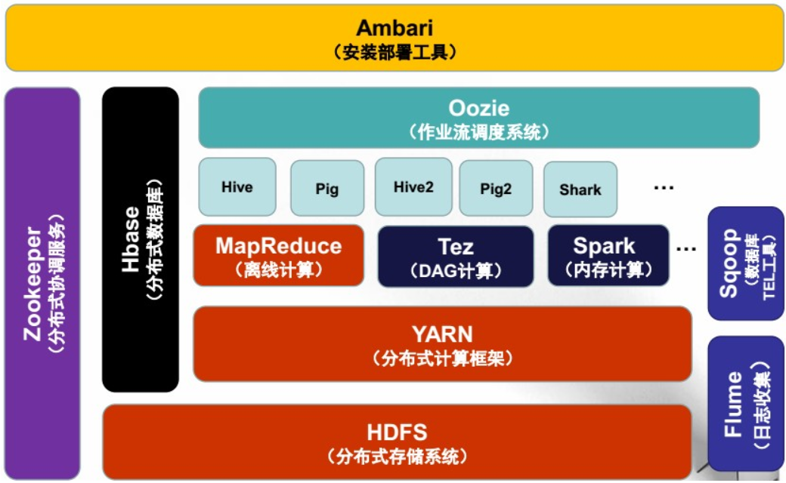

> 在3.x版本中，除了性能方面的提升。在生态，分布式计算框架除了Spark外，Flink也尤为亮眼，且支持更多NameNode，具体参考：https://hadoop.apache.org/docs/r3.0.0/，**本次我们部署的也是22年最新的3.3.1版本**

### 二. Hadoop集群安装

#### 2.1 集群规划

| 集群规划       | 规划                                                         |
| -------------- | ------------------------------------------------------------ |
| 操作系统       | Windows、Mac                                                 |
| 虚拟软件       | VMware（windows）、Parallel Desktop（Mac） 或者直接去云厂商开3台centos7.7 |
| 虚拟机         | 主机名：ben01，IP地址192.168.10.101 主机名：ben02，IP地址192.168.10.102 主机名：ben03，IP地址192.168.10.103 |
| 配置           | 主机01：2核,4G,30G 主机02：1核,2G,30G 主机03：1核,2G,30G |
| 软件包上传路径 | /root/softwares                                              |
| 软件包安装路径 | /usr/local                                                   |
| JDK            | Jdk-8u321-linux-x64.tar.gz                                   |
| Hadoop         | hadoop-3.3.1.tar.gz                                          |
| 用户           | root                                                         |

#### 2.2 安装JDK

> 三台机器都需要做

2.2.1 检查是否有内置JDK，如有则卸载

~~~shell
[root@ben01 ~]# rpm -qa | grep jdk  # 查看是否有
[root@ben01 ~]# rpm -e xxxxxxxx --nodeps  # 有则卸载
~~~

2.2.2 上传jdk1.8到/root/softwares下

2.2.3 解压jdk到/usr/local/下

~~~shell
[root@ben01 ~]# cd softwares/
[root@ben01 softwares]# tar -zxvf jdk-8u321-linux-x64.tar.gz -C /usr/local
~~~

2.2.4 更名jdk

~~~shell
[root@ben01 softwares]# cd /usr/local
[root@ben01 local]# mv jdk1.8.0_321/  jdk
~~~

2.2.5 配置jdk的环境变量：/etc/profile

~~~shell
[root@ben01 local]# vi /etc/profile  # 在最下面添加如下内容

#jdk environment
export JAVA_HOME=/usr/local/jdk
export PATH=$JAVA_HOME/bin:$JAVA_HOME/jre/bin:$PATH
~~~

2.2.6 使当前窗口生效

~~~shell
[root@ben01 local]# source /etc/profile
~~~

2.2.7 验证jdk换季

~~~shell
[root@ben01 local]# java -version
[root@ben01 local]# java
~~~

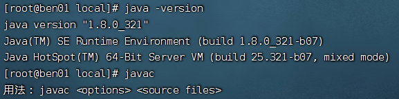

#### 2.3 完全分布式环境需求及安装

~~~~
1. 三台机器的防火墙必须是关闭的
2. 确保三台机器的网络配置通畅
3. 确保/etc/hosts文件配置了IP和hosts的映射关系
4. 确保配置了三台机器的免密登录认证
5. 确保所有机器的时间同步
6. 三台机器JDK和Hadoop的环境变量配置
~~~~

2.3.1 关闭防火墙

~~~shell
[root@ben01 ~]# systemctl stop firewalld
[root@ben01 ~]# systemctl disable firewalld
[root@ben01 ~]# systemctl stop NetworkManager
[root@ben01 ~]# systemctl disable NetworkManager

# 最好也把selinux关闭，将SELINUXTYPE设置为disabled
[root@ben01 ~]# vi /etc/selinux/config
SELINUXTYPE=disabled
~~~

2.3.2 静态IP和主机名配置

> 作者直接开的云厂商的服务

~~~shell
# 1.配置静态IP（确保NAT模式）
vi /etc/sysconfig/network-scripts/ifcfg-ens33

BOOTPROTO=static  # dhcp改为static
............
ONBOOT=yes        # no改为yes
IPADDR=192.168.10.101 # 添加IPADDR属性和ip地址
PREFIX=24  # 添加NETMASK=255.255.255.0 或者 PREFIX=24 
GATEWAY=192.168.10.2  # 添加GATEWAY网关
DNS1=114.114.114.114  # 天假DNS1和备份DNS
DNS2=8.8.8.8

# 2.重启网络服务
systemctl restart network
service network restart

# 3.修改主机名
hostnamectl set-hostname ben01  # 可以设置成自己的名字
hostname  # 即可查看是否设置完成，需要重连才能显示
~~~

2.3.3  配置/etc/hosts文件

> 作者是用的云厂商机器，IP有所不同

~~~shell
[root@ben01 ~]# vi /etc/hosts

127.0.0.1   localhost localhost.localdomain localhost4 localhost4.localdomain4
::1         localhost localhost.localdomain localhost6 localhost6.localdomain6

# 添加本机的静态IP和本机主机名之间的映射关系
10.206.0.10 ben01  
10.206.16.4 ben02
10.206.16.8 ben03
~~~

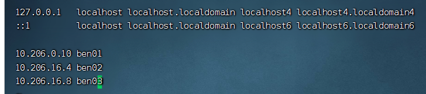

2.3.4 免密登录认证

~~~shell
# 1.使用rsa加密技术，生成公钥和密钥，一路回车即可，三台机器都需要做
[root@ben01 ~]# cd ~
[root@ben01 ~]# ssh-keygen -t rsa

# 2.01免密登录自己和02和03，进入~/.ssh目录下，使用ssh-copy-id命令，需要输入密码
[root@ben01 ~]# cd ~/.ssh
[root@ben01 .ssh]# ssh-copy-id  ben01  # 输入密码
[root@ben01 .ssh]# ssh-copy-id  ben02  # 输入密码
[root@ben01 .ssh]# ssh-copy-id  ben03  # 输入密码

# 3.进行验证，下面第一次执行时输入yes后，不提示输入密码就对了
[root@ben01 .ssh]# ssh ben02
[root@ben01 ~]# ssh localhost
[root@ben01 ~]# ssh 0.0.0.0

# 4.同样的，ben02和ben03也需要做对其它两台的免密
~~~

> 如下图
>
> 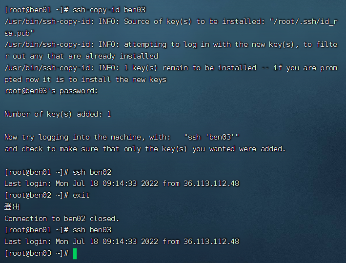

2.3.5 时间同步

> 云厂买的则不需要，已经自动同步了

~~~shell
# 1.选择集群中的某一台机器作为时间服务器，例如ben01
# 2.保证这台服务器安装了ntp.x86_64
# 3.保证ntpd 服务运行
[root@ben01 ~]# sudo service ntpd start
[root@ben01 ~]# chkcofig ntpd on

# 4.配置相应文件
[root@ben01 ~]# vi /etc/ntp.conf
# Hosts on local network are less restricted.
# restrict 192.168.1.0 mask 255.255.255.0 nomodify notrap 
# 添加集群中的网络段位
restrict 192.168.10.0 mask 255.255.255.0 nomodify notrap

# Use public servers from the pool.ntp.org project.
# Please consider joining the pool (http://www.pool.ntp.org/join.html).
# server 0.centos.pool.ntp.org iburst 注释掉
# server 1.centos.pool.ntp.org iburst 注释掉
# server 2.centos.pool.ntp.org iburst 注释掉
# server 3.centos.pool.ntp.org iburst 注释掉
servcer 127.127.1.0    -master作为服务器
# 5.其它机器要保证安装ntpdate.x86_64
# 6.其它机器要使用root定义定时器
*/1 * * * * /usr/sbin/ntpdate -u ben01
~~~

2.3.6 Hadoop安装与环境变量配置

~~~shell
# 1.上传和解压软件包
[root@ben01 softwares]# tar zxvf hadoop-3.3.1.tar.gz -C /usr/local/

# 2.进入local里，给软件改名
[root@ben01 softwares]# cd /usr/local/
[root@ben01 local]# mv hadoop-3.3.1/ hadoop

# 3.配置环境变量，再最下面追加
[root@ben01 local]# vi /etc/profile

......
#hadoop environment
export HADOOP_HOME=/usr/local/hadoop
export PATH=$HADOOP_HOME/bin:$HADOOP_HOME/sbin:$PATH

# 4.刷新环境并验证
[root@ben01 local]# source /etc/profile
[root@ben01 local]# hadoop version
~~~

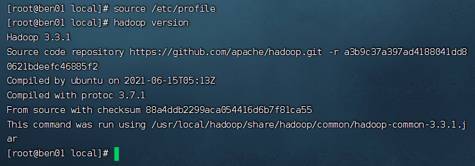

> 注意，是三台机器都完成了如上的操作

#### 2.4 Hadoop的配置文件

2.4.1 概述

我们需要通过配置若干配置文件，来实现Hadoop集群的配置信息。需要配置的文件有：

~~~
hadoop-env.sh
yarn-env.sh
core-site.xml
hdfs-site.xml
mapred-site.xml
yarn-site.xml

在Hadoop安装完成后，会在$HADOOP_HOME/share路径下，有若干个*-default.xml文件，这些文件中记录了默认的配置信息，同时，在代码中，我们也可以配置Hadoop的配置信息。
这些位置配置的Hadoop，优先级为：代码设置 > *-site.xml > *-default.xml
~~~

集群规划：

| Node  | Applications                                                 |
| ----- | ------------------------------------------------------------ |
| ben01 | NameNode DataNode ResourceManager NodeManager |
| ben02 | SecondaryNameNode DataNode NodeManager             |
| ben03 | DataNode NodeManager                                    |

2.4.2 core-site.xml

~~~xml
[root@ben01 ~]# cd $HADOOP_HOME/etc/hadoop/
[root@ben01 hadoop]# vim core-site.xml
<configuration>
        <property>
                <name>fs.defaultFS</name>
                <value>hdfs://ben01:8020</value>
        </property>
        <property>
                <name>hadoop.tmp.dir</name>
                <value>/usr/local/hadoop/tmp</value>
        </property>
</configuration>
~~~

2.4.3 hdfs-site.xml

~~~xml
[root@ben01 hadoop]# vim hdfs-site.xml
<configuration>
    <!-- namenode守护进程管理的元数据文件fsimag存储的位置-->
    <property>
        <name>dfs.namenode.name.dir</name>
        <value>file://${hadoop.tmp.dir}/dfs/name</value>
    </property>
    <!--确定DFS数据节点应该将其块存储在本地文件系统的何处-->
    <property>
        <name>dfs.datanode.data.dir</name>
        <value>file://${hadoop.tmp.dir}/dfs/data</value>
    </property>
    <!--块的副本数-->
    <property>
        <name>dfs.replication</name>
        <value>3</value>
        </property>
        <!--块的大小（128M），下面的单位是字节-->
        <property>
                <name>dfs.blocksize</name>
                <value>134217728</value>
        </property>
        <!-- secondarynamenode守护进程的http地址：主机名和端口号。参考守护进程
布局-->
        <property>
                <name>dfs.namenode.secondary.http-address</name>
                <value>ben02:50090</value>
        </property>
        <!-- namenode守护进程的http地址：主机名和端口号。参考守护进程布局-->
        <property>
                <name>dfs.namenode.http-address</name>
                <value>ben01:50070</value>
        </property>
</configuration>
~~~

2.4.4 mapred-site.xml

~~~xml
[root@ben01 hadoop]# vim mapred-site.xml
<configuration>
        <!--指定mapreduce使用yarn资源管理器-->
        <property>
                 <name>mapreduce.framework.name</name>
                 <value>yarn</value>
        </property>
        <!--配置作业历史服务器的地址-->
        <property>
                <name>mapreduce.jobhistory.address</name>
                <value>ben01:10020</value>
        </property>
        <!-- 配置作业历史服务器的http地址 -->
        <property>
                <name>mapreduce.jobhistory.webapp.address</name>
                <value>ben01:19888</value>
        </property>
</configuration>
~~~

2.4.5 yarn-site.xml

~~~xml
[root@ben01 hadoop]# vim yarn-site.xml
<configuration>

<!-- Site specific YARN configuration properties -->
        <!-- 指定yarn的shuffle技术 -->
        <property>
                <name>yarn.nodemanager.aux-services</name>
                <value>mapreduce_shuffle</value>
        </property>
        <!-- 指定resourcemanager的主机名 -->
        <property>
                <name>yarn.resourcemanager.hostname</name>
                <value>ben01</value>
        </property>
        <!--下面的可选-->
        <!--指定shuffle对应的类-->
        <property>
                <name>yarn.nodemanager.aux-services.mapreduce_shuffle.class</name>
                <value>org.apache.hadoop.mapred.ShuffleHandler</value>
        </property>

        <!--配置resourcemanager的内部通讯地址 -->
        <property>
                <name>yarn.resourcemanager.address</name>
                <value>ben01:8032</value>
        </property>
        <!--配置resourcemanager的scheduler内部通讯地址 -->
        <property>
                <name>yarn.resourcemanager.scheduler.address</name>
                <value>ben01:8030</value>
        </property>
    <!--配置resoucemanager的资源调度的内部通讯地址-->
        <property>
                <name>yarn.resourcemanager.resource-tracker.address</name>
                <value>ben01:8031</value>
        </property>
        <!--配置resourcemanager的管理员的内部通讯地址-->
        <property>
                <name>yarn.resourcemanager.admin.address</name>
                <value>ben01:8033</value>
        </property>
        <!--配置resourcemanager的web ui 的监控页面-->
        <property>
                <name>yarn.resourcemanager.webapp.address</name>
                <value>ben01:8088</value>
        </property>
</configuration>

~~~

2.4.6 hadoop-env.sh

~~~shell
[root@ben01 hadoop]# vi hadoop-env.sh
......
# The java implementation to use. By default, this environment
export JAVA_HOME=/usr/local/jdk
......
~~~

2.4.7 yarn-env.sh

~~~sh
[root@ben01 hadoop]# vi yarn-env.sh
.........
# some Java parameters
export JAVA_HOME=/usr/local/jdk
if [ "$JAVA_HOME" != "" ]; then
  #echo "run java in $JAVA_HOME"
  JAVA_HOME=$JAVA_HOME
fi
.........
~~~

2.4.8 workers

此文件用于指定datanode守护进程所在的机器点主机名

~~~sh
[root@ben01 hadoop]# cat workers
ben01
ben02
ben03
~~~

> **注意**：2.x版本，是添加一个slaves文件，内容与上面一致

2.4.9 分发到另外两台节点

~~~sh
[root@ben01 etc]# cd /usr/local/
[root@ben01 local]# scp -r hadoop ben02:$PWD
[root@ben01 local]# scp -r hadoop ben03:$PWD

# 同步profile到另两台
[root@ben01 local]# scp /etc/profile ben02:/etc
[root@ben01 local]# scp /etc/profile ben03:/etc
~~~

#### 2.5 格式化与启动

2.5.1 格式化集群

1）在ben01机器上运行命令

~~~sh
[root@ben01 local]# hdfs namenode -format
~~~

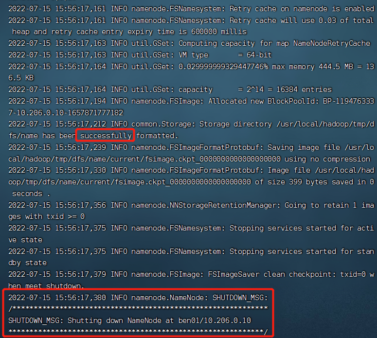

> **用户切换，或权限不足的报错**
>
> 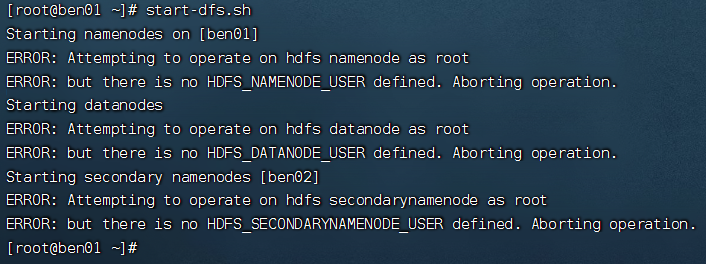
>
> **原因**
>
> 用户切换，或权限不足
>
> **解决办法**
>
> 将上面的hadoop-env.sh文件，添加如下内容
>
> ~~~sh
> export HDFS_NAMENODE_USER=root
> export HDFS_DATANODE_USER=root
> export HDFS_SECONDARYNAMENODE_USER=root
> export YARN_RESOURCEMANAGER_USER=root
> export YARN_NODEMANAGER_USER=root
> ~~~

2）格式化的相关信息解读

~~~sh
--1.生成一个集群唯一标识符：clusterID
--2.生成一个块池唯一标识符：blockPoolID
--3.生成namenode进程管理内容（fsimage）的存储路径：
默认配置文件属性hadoop.tmp.dir指定的路径下生成dfs/name目录
--4.生成就想fsimage，记录分布式文件系统根路径的元数据
--5.其它信息都可以查看下，比如块的副本数，集群的fsOwner等
~~~

3）目录里的内容查看

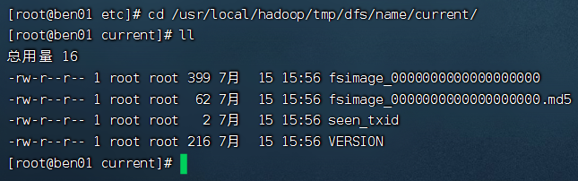

2.5.2 启动集群

1）启动脚本和关闭脚本介绍

~~~sh
1.启动脚本
  -- start-dfs.sh  	:用于启动hdfs集群的脚本
  -- start-yarn.sh	:用于启动yarn守护进程
  -- start-all.sh	:用于启动hdfs和yarn
2.关闭脚本
  -- stop-dfs.sh	:用于关闭hdfs集群的脚本
  -- stop-yarn.sh	:用于关闭yarn守护进程
  -- stop-all.sh	:用于关闭hdfs和yarn
3.单个守护进程脚本
  -- hadoop-daemons.sh	:用于单独启动或关闭的某一个守护进程的脚本
  -- hadoop-daemon.sh	:用于单独启动或关闭hdfs的某一个守护进程的脚本
  reg:
    hadoop-daemon.sh [start|stop] [namenode|datanode|secondarynamenode]
  
  -- yarn-daemons.sh	:用于单独启动或关闭hdfs的某一个守护进程的脚本
  -- yarn-daemon.sh		:用于单独启动或关闭hdfs的某一个守护进程的脚本
  reg:
    yarn-daemon.sh [start|stop] [resourcemanager|nodemanager]
~~~

2）启动HDFS

~~~sh
[root@ben01 hadoop]# start-dfs.sh
~~~

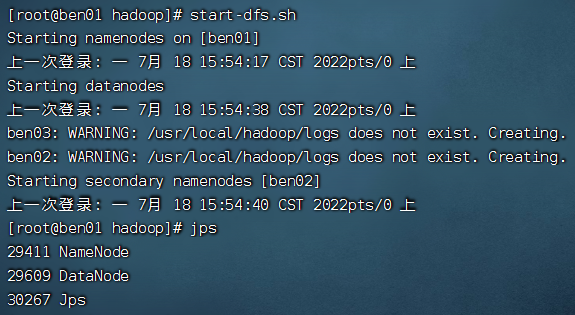

> **主机间没做免密的报错**
>
> 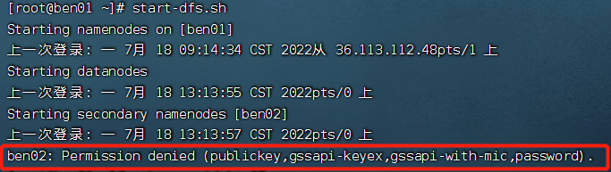

3）验证，jps查看进程，具体如下

~~~sh
[root@ben01 hadoop]# jps
29411 NameNode
8233 Jps
29609 DataNode

[root@ben02 hadoop]# jps
19457 Jps
18914 DataNode
19127 SecondaryNameNode

[root@ben03 hadoop]# jps
19252 Jps
17960 DataNode
~~~

4）启动yarn

~~~sh
[root@ben01 hadoop]# start-yarn.sh
~~~

> 成功图如下：
>
> 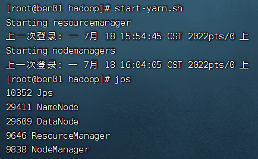

jps查看如下

~~~sh
[root@ben01 hadoop]# jps
10352 Jps
29411 NameNode
29609 DataNode
9646 ResourceManager
9838 NodeManager

[root@ben02 hadoop]# jps
18914 DataNode
31219 NodeManager
19127 SecondaryNameNode
31561 Jps

[root@ben03 ~]# jps
30023 NodeManager
17960 DataNode
31913 Jps
~~~

5）WebUI查看

~~~sh
HDFS: http://1.13.169.142:50070
YARN: http://1.13.169.142:8088
~~~

> 如果是云厂买的注意开放对应端口，效果图如下
>
> 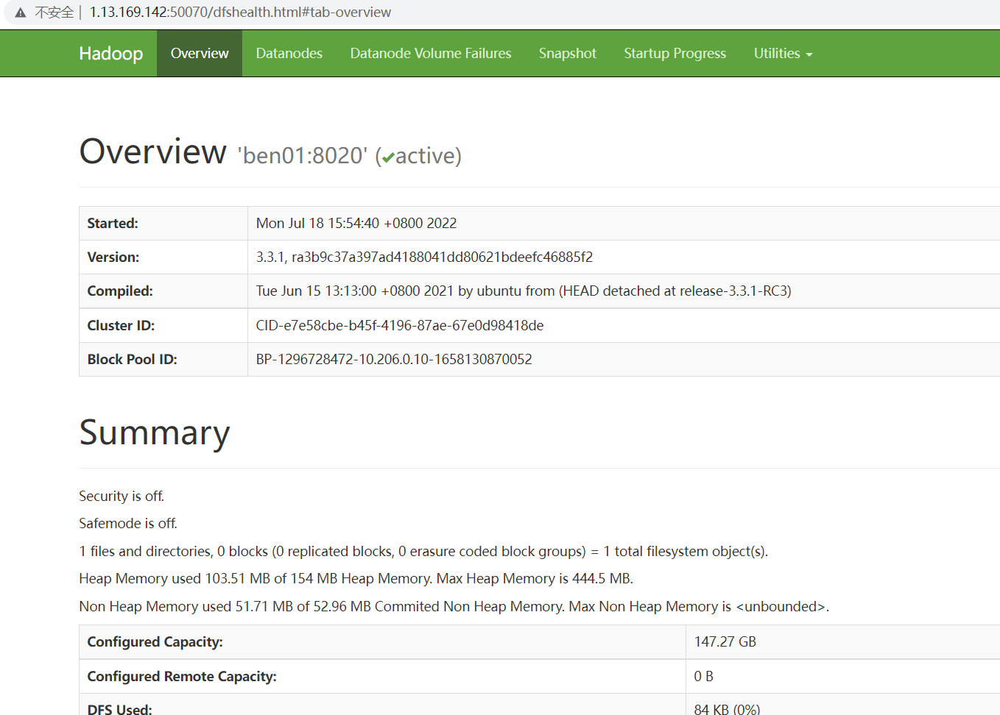
>
> 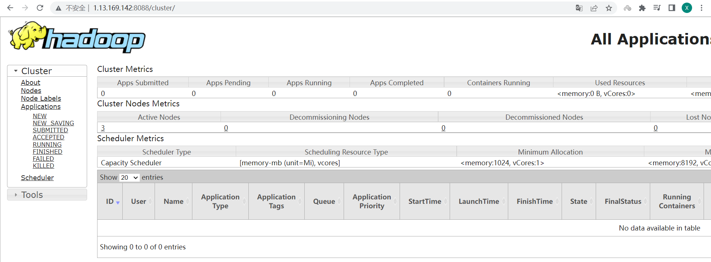

致此，恭喜你，hadoop集群已安装完成。

> 需要关机的话，先stop-all.sh停止服务，开机后再start-all.sh启动

### 三. HDFS的Shell命令

简介

~~~sh
HDFS是一个分布式文件系统，我们可以使用一些命令来操作这个分布式文件系统上的文件。
-- 访问HDFS的命令：
    hdfs dfs

-- 小技巧
	1.在命令行中输入hdfs，回车后，就会提示hdfs可以使用哪些明了，其中一个是dfs
	2.在命令行中输入hdfs dfs，回车后，就会提示dfs可以添加哪些常用shell命令

-- 注意事项
	分布式文件系统的路径在命令行中，要从/开始写，即绝对路径。
~~~

#### 3.1 创建目录

~~~sh
[-mkdir [-p] <path> ...] #分布式文件系统上创建目录 -p，多层级创建

调用格式：hdfs dfs -mkdir (-p) /目录
如：
[root@ben01 ~]# hdfs dfs -mkdir /data
[root@ben01 ~]# hdfs dfs -mkdir -p /data/a/b/c
~~~

> 如下图
>
> 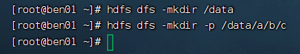
>
> 可以在命令行查看
>
> [root@ben01 ~]# hdfs dfs -ls /
>
> 也可以在UI页面查看
>
> 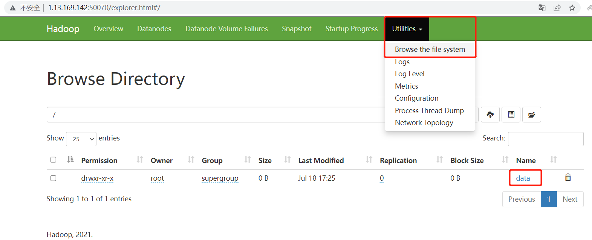

#### 3.2 上传命令

~~~sh
[-put [-f] [-p] [-l] <localsrc> ... <dst>]  # 将本地文件系统的文件上传到分布式文件系统

调用格式: hdfs dfs -put /本地文件 /分布式文件系统路径
注意：直接写/是省略了文件系统的名称hdfs://ip:port
如：
# 先创建并往文件写内容
[root@ben01 ~]# echo "Hello, ben" > test.txt
[root@ben01 ~]# hdfs dfs -put test.txt /data/
# 查看上传后的内容
[root@ben01 ~]# hdfs dfs -cat /data/test.txt
~~~

> 效果图如下
>
> 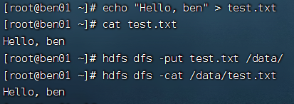
>
> 同样能在UI页面看到
>
> 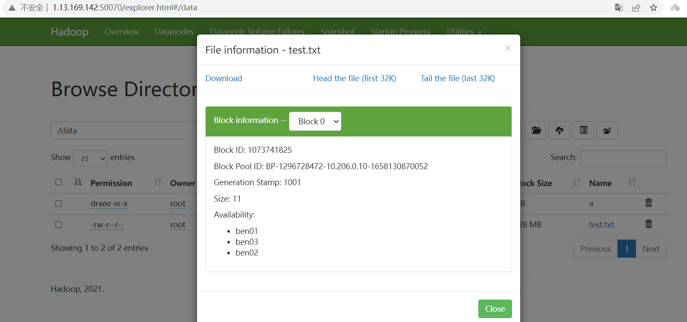

#### 3.3 创建空文件

~~~sh
[root@ben01 ~]# hdfs dfs -mkdir /empty
[root@ben01 ~]# hdfs dfs -touchz /empty/emp
~~~

> 效果图如下，大小为0B
>
> 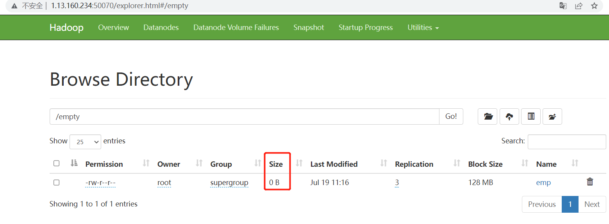
>
> 注：由于我重启机器了，外网IP有所变化

#### 3.4 向分布式文件系统中的文件里追加内容

~~~sh
[root@ben01 ~]# echo "Hello ben" >> e1
[root@ben01 ~]# hdfs dfs -appendToFile e1 /empty/emp
~~~

> 效果图如下，大小为10B
>
> 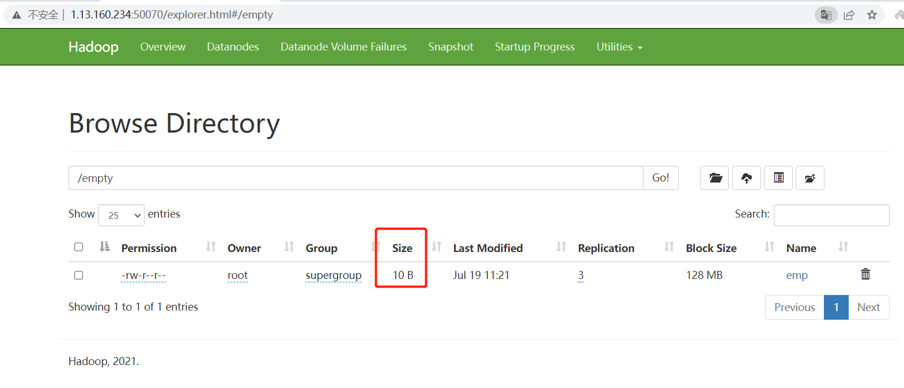

#### 3.5 查看指令

~~~sh
# 查看分布式文件系统的目录里的内容
[root@ben01 ~]# hdfs dfs -ls /
# 查看分布式文件系统的文件内容
[root@ben01 ~]# hdfs dfs -cat /xxx.txt
# 查看分布式系统的文件内容
[root@ben01 ~]# hdfs dfs -tail /xxx.txt
~~~

#### 3.6 下载指令

~~~sh
[root@ben01 ~]# hdfs dfs -copyToLocal /empty ./
~~~

> 效果图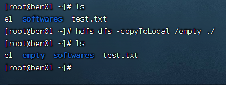

#### 3.7 合并下载

~~~sh
# 先创建几个文件
[root@ben01 ~]# echo "Hello ben01" >> file1
[root@ben01 ~]# echo "Hello ben02" >> file2
[root@ben01 ~]# echo "Hello ben03" >> file3
#上传file*文件
[root@ben01 ~]# hdfs dfs -put file* /

# 合并下载file下的文件到本地file下，
[root@ben01 ~]# hdfs dfs -getmerge /file* ./file
~~~

> 效果图
>
> 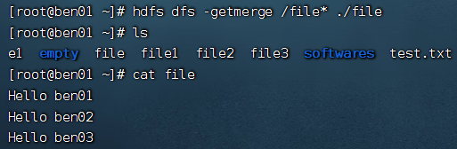

#### 3.8  移动（更名）hdfs中的文件

~~~sh
[root@ben01 ~]# hdfs dfs -mv /file1 /empty
~~~

#### 3.9 复制hdfs的文件到hdfs的另一个目录

~~~sh
[root@ben01 ~]# hdfs dfs -cp /file2 /empty
~~~

#### 3.10 删除命令

~~~sh
[root@ben01 ~]# hdfs dfs -rm /file*
Deleted /file2
Deleted /file3

[root@ben01 ~]# hdfs dfs -rmdir /empty/
# 注：必须是空文件夹
~~~

#### 3.11 查看磁盘利用率和文件大小

~~~sh
[root@ben01 ~]# hdfs dfs -df -h
Filesystem            Size     Used  Available  Use%
hdfs://ben01:8020  147.3 G  255.8 K    127.1 G    0%

[root@ben01 ~]# hdfs dfs -du -h /data
0   0   /data/a
11  33  /data/test.txt
~~~

#### 3.12 修改权限

~~~sh
[root@ben01 ~]# hdfs dfs -chmod 777 /data
# 页面Permission的drwxr-xr-x刷新后会变为drwxrwxrwx
# 也可以修改Owner和Group
[root@ben01 ~]# hdfs dfs -chown ben:ben /data
# 页面的Owner和Group会从root:supergroup 变为ben:ben
# 再修改回来
[root@ben01 ~]# hdfs dfs -chown root:supergroup /data
~~~

#### 3.13 修改文件副本数

~~~sh
[root@ben01 ~]# hdfs dfs -setrep 5 /data
Replication 5 set: /data/test.txt

# 之前data下的test.txt的Replication会从3刷新后变成5
# 再改回来
[root@ben01 ~]# hdfs dfs -setrep 3 /data
Replication 3 set: /data/test.txt
~~~

#### 3.14 查看文件的状态

~~~sh
[root@ben01 ~]# hdfs dfs -stat %b /data/test.txt
11

# 调用格式：hdfs dfs -stat [format] 文件路径
%b: 打印文件大小（目录大小为0）
%n: 打印文件名
%o: 打印block的size
%r: 打印副本数
%y: utc时间 yyyy-MM-dd HH:mm:ss
%Y: 打印自1970年1月1日至今的utc微秒数
%P: 目录打印directory，文件打印regular file

# 注意：
1）当使用-stat命令但不指定format时，只打印创建时间，相当于%y
2）-stat后面只跟目录，%r，%o等打印的都是0，只有文件才有副本和大小
~~~

#### 3.15 测试

~~~sh
hdfs dfs [generic options] -test -[defsz] <path> 
# 参数说明：
-e:文件是否存在，存在返回0
-z:文件是否为空，为空返回0
-d:是否是路径（目录），是返回0
# 如下，存在则返回OK
[root@ben01 ~]# hdfs dfs -test -e /data/test.txt && echo "OK" || echo "NO"
OK
# 已知道没有test111.txt这个文件
[root@ben01 ~]# hdfs dfs -test -e /data/test111.txt && echo "OK" || echo "NO"
NO
~~~

### 四. HDFS块的概念

#### 4.1 传统型分布式文件系统的缺点

现在想象一下这种情况：有四个文件0.5TB的file1，1.2TB的file2，50GB的file3，100GB的file4；有7个服务器，每个服务器上有10个1TB的硬盘。

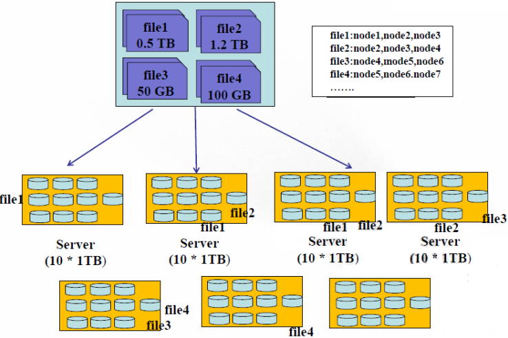

在存储方式上，我们可以将四个文件存储在同一服务器上（当然大于1TB的文件需要切分），那么缺点也暴露了出来：

1. 负载不均衡

   ~~~
   因为文件大小不一致，势必会导致有的节点磁盘的利用率高，有的利用率低
   ~~~

2. 网络瓶颈问题

   ~~~
   一个过大的文件存储在一个节点磁盘上，当并行处理时，每个线程都需要从这个节点磁盘上读取这个文件内容，那么就会出现网络瓶颈问题，不利于分布式的数据处理。
   ~~~

#### 4.2 HDFS块

HDFS与其它普通文件系统一样，同样引入了块（Block）的概念，并且块的大小是固定的。块是HDFS系统当中的最小存储单位，在Hadoop2.x中默认大小为128MB。在HDFS上的文件会被拆分成多个块，每个块作为独立的单元进行存储。多个块存放在不同的DataNode上，整个过程中HDFS系统会保证一个块存储在一个数据节点上。另外，如果某个文件大小或最后一个块没有达到128MB，则不会占用整个块空间。

以下图为例：

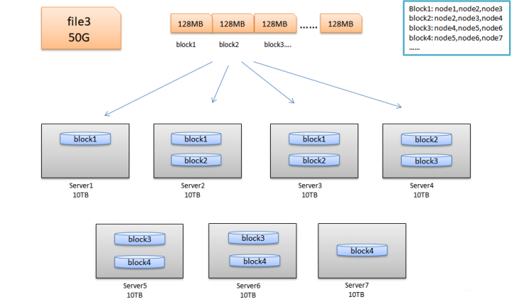

> 可以看到50G的file3文件会以128MB一个块切分到7台DataNode节点上，每个节点均衡1~2个块

#### 4.3 HDFS块的大小

HDFS块大小为什么为128MB

1. 目的是为了最小化寻址开销时间。
   1. 在I/O开销中，机械硬盘的寻址时间是最耗时的部分，一旦找到第一条记录，剩下的顺序读取效率是非常高的，因此，合适的block大小有助于减少硬盘寻道时间（平衡了硬盘寻道时间、IO时间），提高系统吞吐量。
   2. HDFS寻址开销不仅包括磁盘寻道开销，还包括数据块的定位开销，客户端访问一个文件的流程：名称节点获取组成这个文件的数据块位置列表——>根据位置列表获取到每个数据块的数据节点位置——>数据节点根据数据块信息在本地Linux文件系统中找到对应文件，并返回客户端。
   3. 磁盘的寻址时间为大约5~15ms之间，平均值为10ms，而最小化寻址开销时间普遍认为占1秒的百分之一为最优，那么块的大小就参考1秒的传输速度。
2. 为了节省内存的使用率
   1. 一个块的元数据大约为150个字节。1亿个块，无论大小，都会占用20G左右的内存。因此块越大，集群相对存储数据就越多。这也暴露了HDFS的一个缺点，不适合存储小文件。
      - 不适合小文件的解释，从存储出发：虽然文件不到128M时不能占用整个空间，但是这个块的元数据依然会在内存中占150个字节
      - 不适合小文件的解释，从内存占用出发：假设存储一个块都是占用1M和都是128M，同样存储1PB数据，如果是以1M的小文件存储，占用的内存空间为1PB/1MB×150Byte=150G的内存。如果是以128MB的文件存储，占用空间为1PB/128M×150Byte=1.17G的内存占用。可以看到小文件存储比大文件存储占用更多内存。

#### 4.4 块的相关参数设置

~~~xml
# 块大小在默认配置文件hdfs-default.xml中，我们可以在hdfs-default.xml中进行重置
[root@ben01 hadoop]# ll /usr/local/hadoop/etc/hadoop/hdfs-site.xml
<property>
	<name>dfs.blocksize</name>
    <value>134217728</value>
	<description>默认块大小，以字节为单位。可以使用以下后缀（不区分大小写）：k,m,g,t,p,e以重新指定大小(例如128k, 512m, 1g等)</description>
</property>

<property>
    <name>dfs.namenode.fs-limits.min-block-size</name>
    <value>1048576</value>
    <description>以字节为单位的最小块大小，由Namenode在创建时强制执行时间。可以防止意外创建带有小块文件降低性能</description>
</property>

<property>
    <name>dfs.namenode.fs-limits.max-blocks-per-file</name>
    <value>1048576</value>
    <description>每个文件的最大块数，由写入时的Namenode执行。这可以防止创建降低性能的最大文件</description>
</property>
~~~

