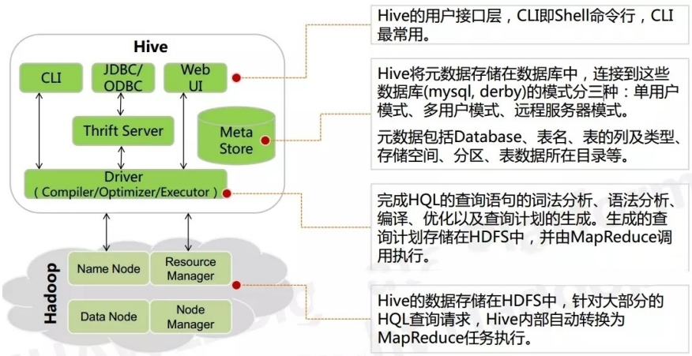
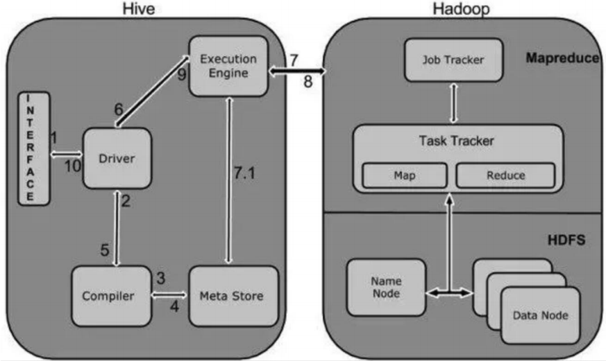
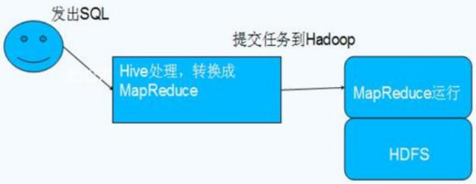

# 第二章——Hive

### 一. Hive开篇

#### 1.1 hive简介

##### 1.1.1 hive出现的原因

视频网站每天产生海量的结构化日志数据，为了对这些数据进行管理，且因机器学习的需求，产生了hive这门技术，并继续发展成为一个成功的Apache项目。

##### 1.1.2 什么是hive

hive是构建在Hadoop上的数据仓库工具（框架），可以将结构化的数据文件映射成一张数据表，并可以使用类sql的方式来对这样的数据文件进行读、写以及管理（包括元数据）。这套HIVE SQL简称HQL。hive的执行引擎可以是MR、Spark以及Tez。

如果执行引擎是MapReduce的话，hive会将HQL翻译成MR进行数据的计算。用户可以使用命令行工具或JDBC驱动程序来连接到hive。

##### 1.1.3 为什么使用hive

因为直接使用MapReduce需要面临以下问题：

- 人员学习成本高
- 项目周期要求太短
- MapReduce实现复杂查询逻辑开发难度大

##### 1.1.4 hive的优缺点

1）hive的优点

- 学习成本低
  - 提供类SQL查询语法HQL（简单、容易上手），避免直接写MapReduce（适合java语音不好的，sql熟练的人）
- 可扩展性好
  - 为超大数据集设计了计算/扩展能力（MR作为计算引擎，HDFS作为而存储系统），Hive可以自由的扩展集群的规模，一般情况下不需要重启服务。
- 适合做离线分析处理（OLAP）
  - Hive的执行延迟比较高，因此Hive常用于数据分析，对实时性要求不高的场合。
- 延展性好
  - Hive支持用户自定义函数，用户可以根据自己的需求来实现自己的函数。
- 良好的容错性
  - 某个数据节点出现问题HQL仍可完成执行。
- 统计管理
  - 提供了统一的元数据管理

2）hive的缺点

- hive的HQL表达能力有限
  - 迭代式算法无法表达，比如PageRank（网页排名）
  - 数据挖掘方面，比如KMeans（k均值聚类算法）
- hive的效率比较低
  - hive自动生成的MapReduce作业，通常情况下不够智能化
  - hive调优比较苦难，粒度较粗

#### 1.2 Hive架构和原理

##### 1.2.1 hive的架构简介

从上图可以看出，Hive的体系结构分位以下几部分：

~~~
1. 用户连接接口
	CLI：指Shell命令行。
	JDBC/ODBC：指Hive的java实现，与传统数据库JDBC类似。
	WebUI：指可通过浏览器访问Hive。
2. Thrift Server：
	hive的可选组件，是一个软件框架服务，允许客户端使用包括Java、C++、Ruby和其它多种语言，通过编程的方式远程访问Hive。
3. Meta Store
	Hive将元数据存储在数据库中，如mysql、derby。hive中的元数据包括（表名、表所属的数据库表名、表的拥有者、列/分区字段、表的类型（是否是外部表）、表的数据所在目录等）
4. 驱动器（Driver）
	- 解析器（SQLParser）：
	  将HQL字符串转换成抽象语法树AST，这一步一般都用第三方工具库完成，比如antlr；对AST进行语法分析，比如表是否存在、字段是否存在、SQL语义是否有误。
	- 编译器（Compiler）：
	  对hql语句进行词法、语法、语义的编译（需要跟元数据关联），编译完成后会生成一个执行计划。hive上就是编译成MapReduce的job。
	- 优化器（Optimizer）：
	  将执行计划进行优化，减少不必要的列、使用分区、使用索引等，优化job。
    - 执行器（Executer）：
      将优化后的执行计划提交给hadoop的yarn上执行。提交job。
5.hadoop
	Jobtracker是hadoop1.x中的组件，它的功能相当于：Resourcemanager+AppMaster
	TaskTracker相当于：Nodemanager+yarnchild
	
	Hive的数据存储在HDFS中，大部分的插叙、计算由MapReduce完成
~~~

注意：

~~~~
- 包含*的全表查询，比如select * from table 不会生成MapReduce任务
- 包含*的limit查询，比如select * from table limit 10 不会生成MapReduce任务
~~~~

##### 1.2.2 hive的工作原理

~~~
1. 用户提交查询等任务给Driver。（可以选择CLI/JDBC/Web UI）
2. 驱动程序将Hql发送编译器，检查语法和生成查询计划。
3. 编译器Compiler根据用户任务去MetaStore中获取需要的Hive的元数据信息。
4. 编译器Compiler得到元数据信息，对任务进行编译，先将HiveQL转换为抽象语法树，然后抽象语法树转换成查询块，将查询块转化为逻辑的查询计划，重写逻辑查询计划，将逻辑计划转化为物理的计划（MapReduce），最后选择最佳的策略。
5. 将最终的计划提交给Driver。到此为止，查询解析和编译完成。
6. Driver将计划Plan转交给ExecutionEngine去执行。
7.1 在内部，执行作业的过程是一个MapReduce工作。执行引擎发送作业给JobTracker，在名称节点并把它分配作业到TaskTracker，这是在数据节点。在这里，查询执行MapReduce工作。
7.2 与此同时，执行时的执行引擎可以通过MetaStore执行元数据操作。
8. 执行引擎接收来自数据节点的结果。
9. 执行引擎发送这些结果值给驱动程序。
10. 驱动程序将结果发送给Hive接口。
~~~

##### 1.2.3 Hive和Hadoop的关系

~~~
- hive本身没有多少功能，hive相当于在hadoop上包了一个壳子，就是对hadoop进行了一次封装。
- hive的存储是基于hdfs/hbase的，hive的计算是基于mapreduce。
参考下图：
~~~

#### 1.3 hive与传统数据库的区别

