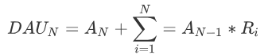

# README

准实时数仓项目

### 一.项目背景

#### 1.简介

**WAHT:**基于数据采集与监控。其中用户行为数据、内容数据、业务数据收集到HDFS。我们着重普及事件分析、漏斗分析、留存分析在用户模型分析在用户模型分析中最常见的3个分析模型。

**WHY:**搭建数仓的最终目的是为了使得数据更为高效的令其产生价值。数据仓库的手段不一，但最终目的是一致的。

**HOW:**如经典模型：DAU[日常活跃用户统计：Daily Active User]预测未来一段时间的日活跃用户，根据活跃用户可以指定策略等。如生鲜市场备货等，更有效的减少损耗，提高资源利用率。

#### 2.行为分析模型

在分析模型中经常会出现两个名词：指标和维度。

- 指标：具体的数值。新闻浏览量、新闻点击量。指标一般都要结合维度才能产生更大的价值。
- 维度：看数据的角度，描述一个事物本身具备的特征或属性。在数据分析领域，维度通常用来描述分析指标（如上面的新闻分成实事、娱乐的维度，亦或者分为国内、国外的维度）。

#### 2.1.事件分析

用来追踪用户行为的。在行为日志中有个event：AppClick

- 所谓事件分析，就是基于事件的指标统计。

  - 最近一周哪个渠道的新增用户最多，以及变化趋势。

    > 其中“最近一周”和“哪个渠道”都是维度，“新增用户”量和“变化趋势”则是指标

  - 每天每个地域的活跃用户数。

#### 2.2.留存分析

**WHAT:**一种用来分析用户参与情况/活跃程度的分析模型，考察进行初始行为的用户中，有多少人会进行后续行为。

> 在互联网行业里，通常我们会通过拉新把客户引过来，但是经过一段时间可能就会有一部分客户逐渐流失了。那些留下来的人或者是经常回访我们公司网站 / App 的人就称为留存。

**WHY:**用来衡量产品对用户价值高低的重要方法。

> 如某个社交产品改进了新注册用户的引导留存，期待改善用户注册后的参与程度，这样用留存分析就可以验证改进的效果。亦或者是判断某项产品改动是否奏效，如新增了一个邀请好友的功能，观察是否有人因新增功能而多使用产品几个月。

特点与价值

- 留存率是判断产品价值最重要的标准，揭示了产品保留用户的能力
- 宏观上把握用户生命周期长度以及定位产品可改善至之处

#### 2.3.漏斗分析

**WHAT:**一套流程式数据分析，它能够科学反映用户行为状态以及从起点到终点各阶段用户转化率情况的重要分析模型。

> 漏斗的步骤、漏斗的时间范围、漏斗的窗口期。
>
> 漏斗分析模型已经广泛应用于流量监控、产品目标转化等日常数据运营与数据分析的工作中。例如在一款产品服务平台中，直播用户从激活APP开始到花费，一般的用户购物路径为激活APP、注册账号、进入直播间、互动行为、礼物花费五大阶段，漏斗能够展现出各个阶段的转化率，通过漏斗各环节相关数据的比较,能够直观地发现和说明问题所在，从而找到优化方向。

特点与价值

- 企业可以监控用户在各个层级的转化情况，聚焦用户选购全流程中最有效转化路径；同时找到可优化的短板，提升用户体验。
- 多维度切分与呈现用户转化情况，成单瓶颈无处遁形。
- 不同属性的用户群体漏斗比较，从差异角度窥视优化思路。

#### 2.3.1.DAU预测

日活跃用户数量。

> 一般用于反映网站、互联网应用等运营情况。结合MAU（月活跃用户数量）一起使用，用来衡量服务的用户粘性以及服务的衰退周期。

> $$
> A_N:表示第N日的新增用户\\
> R_i:第i天的留存率
> \sum_{i=1}^N=A_{N-i}*R_i:第N-i天的新增和第i天的留存率乘积之和
> $$
>
> 整个公式：`当天的日活`=`当天的新增用户`+`之前每天新增用户到当日的用户之和`

### 二.项目需求

#### 1.数据

#### 1.1.数据表

| 数据库   | 数据表       | 描述                        |
| -------- | ------------ | --------------------------- |
| ods_news | news         | 原始行为数据                |
| ods_news | news_parquet | 原始数据，json转换为parquet |
| ods_news | news_article | 通过HTTP请求过来的内容日志  |
| ods_news | ad_info      | 从MySQL过来的广告信息       |
| ods_news | meta         | 从MySQL过来的元信息         |

#### 1.2.行为数据解释

