# README

# 采集与监控平台-头条新闻资讯类APP

### 一. 项目背景

#### 1. 简介

**WHAT:**学习大数据课程，首先要知道数据从何而来（产生）。

**WHY:**针对不同场景和不同类型的数据应该使用什么样的技术去收集，当有了数据之后才能在这些数据集上探索利用它们，从中挖掘价值。我们还要对数据采集过程的重要指标进行监控，当数据采集发生故障时我们能够及时收到报警，同时当我们遇到性能问题时，通过监控系统我们能更有针对性的优化采集流程。

#### 2. 基本概念

讨论一件事情一般要有上下文的限定，这里我们限定我们的讨论范围是做C端产品（比如`头条`、`快手`、`微信`、`美团`等移动端可以下载的APP）公司的日志。这些公司不仅有APP，可能还有自己的网站，小程序等，这些应用产生的日志都在我们的讨论范围之内。

#### 2.1.行为日志

**WHAT:**我们先引入第一个概念`用户行为日志`，用户行为日志是指用户和应用之间进行交互时，由应用本身记录下来的具有一定格式的文本数据，这个文本数据就是用户行为日志。

**HOW:**比如当我们在手机上打开美团，此时美团APP就会在后台生成一条日志，记录这个设备进行了启动操作，比如

~~~
{
  "client_time": 1587523571,
  "event_name": "StartAPP",
  "properties": {
      "os": "android",
      "imei": "868034031518269",
      "model": "HUAWEI MT7-L09",
      "wifi": true
      ...
  },
  ...
}
~~~

这条json数据就是一条行为数据了，不同的应用会有自己的格式定义，但是核心思想不变，就是要记录一个用户什么时间在什么位置做了什么样的操作。上面说的是APP日志，还有网站、小程序等需要和用户交互的都可以产生此类日志。因为这些数据都由客户端应用上报的，我们也叫客户端日志。

#### 2.2. 内容日志

不同的公司根据其业务场景不同，会有不同的`内容日志`，比如头条是做资讯的，那么每条新闻咨询就是一条内容日志，包含了文本信息和图片信息。淘宝是做电商的，每条商品信息就是一条内容日志，这些日志也可以用一个json描述出来。这些日志的来源可能是UGC（用户产生的内容），也可能是PGC（专业生产内容的团队）。

#### 2.3. 业务日志

**WHAT:**这里的`业务日志`是指由公司服务端业务系统产生的数据，这样数据往往存储在服务端的数据库中，内容日志也往往存储在服务端的数据库中，但是和内容日志不同的是，业务日志是应用逻辑的支撑，我们叫业务日志，在服务端看来就是数据库中的表。这里的数据库可能是关系型也可能是非关系型。

> 我们在互联网大数据领域研究的数据，基本就是上述三种类型的数据。

#### 2.4. 元数据

**WHAT:**元数据用来`描述数据`的数据。如，我们再MySQL创建了一张表，我们创建这张表的同时MySQL会记录下我们创建的表的名字，创建的列的字段信息（列名、数据类型等），索引信息等，这些信息就叫做这张表的元信息，它不是表中的数据，而是描述这些数据用的，这些信息存储在MySQL的`information_shcema`库中。只要是描述数据而用的，都可以叫元数据。

#### 3. 场景

在企业中我们要构建数据平台，第一步先要设计我们的数据采集系统，先把数据从各个源头收集过来。此项目我们以信息流产品类型的企业数据来讲解如何构建数据数据采集及监控系统。对于信息流产品，如`今日头条`、`抖音`、`快手`等都是信息流产品，有的除了图文还有视频，本项目以图文信息流产品为例。

### 二. 项目需求

#### 1. 数据源

在项目背景中我们已经知道，需要采集的是信息流产品的数据信息。在这里我们限定我们需要采集的数据是新闻资讯类的产品，类似头条。需要收集的日志如下：

- 用户行为数据。包含用户启动APP，各页面的浏览、点击、分享、收藏广告的点击等行为日志，这些日志会在`客户端埋点`，将数据通过HTTP请求发送到我们设计的数据接口。

  > 如何埋点，写一段Android或IOS代码，监听用户在页面的操作，并按照一定的数据格式记录下俩，之后发送HTTP请求即可。可以自己写代码，也可以选择开源的埋点SDK，比如`sa[sensors data]`，`argo`等。有了客户端发过来的数据，那么我们再设计HTTP数据接口就能让这些数据实时发送到接口中。

- 资讯数据，这些数据有专门的数据公司提供，一般会有两种方式让我们获取数据。

  - 第一种，拉模式，他们提供HTTP接口，我们通过接口拉取数据。

    > 一般选这种，方便可控。

  - 第二种，推模式，我们提供HTTP接口给他们，他们往接口推数据。

  数据会先被服务端拉取（前面说的第一种模式），供线上业务使用，如果数据部分需要这部分数据，服务端可以选择在拉取到数据后给数据部分推一份过去。数据端也可以主动去对应的业务库拉数据。在这里我们选择提供HTTP接口，服务端先去拉数据，再把数据推给我们。

- 业务数据，由于服务端业务表非常多，我们只抽取广告信息表的数据做案例，此表在MySQL中，存储着每条广告的基本信息和对应的广告主。需要我们同步此表的数据到HDFS中。

#### 2. 目标

- 数据采集到HDFS。

  > 针对现有的三种数据源设计数据收集方案，将数据采集到HDFS中，建立相对应的Hive表，以供后续进行数据的联合分析。

- 数据时间自适应。

  > 用户行为和内容数据落到HDFS上均自动按天进行分目录，分目录的时间应当以每条`日志中的时间字段`为准。不能以当下时间为准，这样保证数据有延迟时，每条日志依然归属到其本身对应的时间日期中，业务数据直接全量同步。

- 数据自校验。

  > 数据落地后，简历Hive外部表，并通过Azkaban调度Shell作业，自动检测当日数据目录是否已存在，并自动添加分区。
  >
  > Hive是读时模式，即便当日数据目录不存在，一样可以成功添加分区，这里之所以要检测目录是为了后续项目做准备。

- 监控告警。

  > 基于`Prometheus`、`Grafana`搭建监控系统，监控采集流量的重要指标，需要监控的指标有HTTP数据接口的`QPS`、`99延时`、Flume的`channel填充量`、`发送Event速度`。当指标异常是发出报警，我们选择奖报警消息发送到钉钉或企业微信。

#### 3. 二次开发

##### 3.1. Azkaban Alert 二次开发

需要对Azkaban的`报警进行二次开发`，使其支持将调度失败的信息发送至我们自有的报警中心，在这里我们直接开发使其支持将失败消息发送至钉钉。

##### 3.2. Flume Interceptor 二次开发

因为我们的行为数据是经过BASE64编码的（下方架构会有说明），但落地到HDFS时如果我们需要直接用日志中的某个字段值作为我们HDFS上的目录划分，就必须先对BASE64进行编码，然后取出字段值放到Flume的头信息中，在Sink端配置使用。

### 三. 架构及阐述——核心

- 采集`架构一`采用LVS+Nginx(OpenResty)+Lua+Flume+Sqoop+Hadoop+Hive+Azkaban+SpringBoot
- 采集`架构二`采用LVS+Nginx(OpenResty)+Lua+Kafka+Sqoop+DataX+Hadoop+Hive+Azkaban+SpringBoot
- 整体监控架构采用`Prometheus`+`Grafana`+`IM`方案
- 本项目中的组件监控`ngingx-lua-prometheus`+`flume-expoter`+`Prometheus`+`Grafana`+`Supervisor`+`IM`
- 元数据管理及实施数据接收`FRP(Ngrok)`+`Supervisor`+`Metaserver`+`qfapp`

#### 1. 架构图

设计两个架构图，架构一不涉及`Kafka`、`Spark`、`Flink`。架构二作为参考架构。后面讲完`Kafka`、`Spark`、`Flink`等组件后由大家自己思考

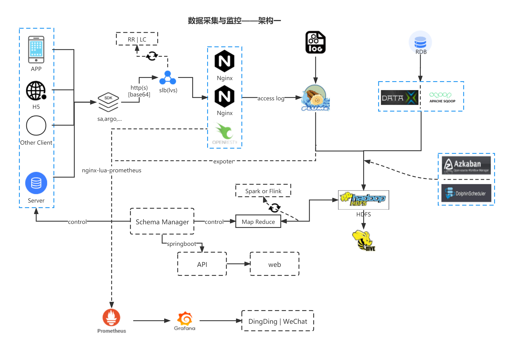

> 数据采集与监控架构一，也是我们这次实战使用的架构，架构阐述在三.1.3架构阐述会进行阐述

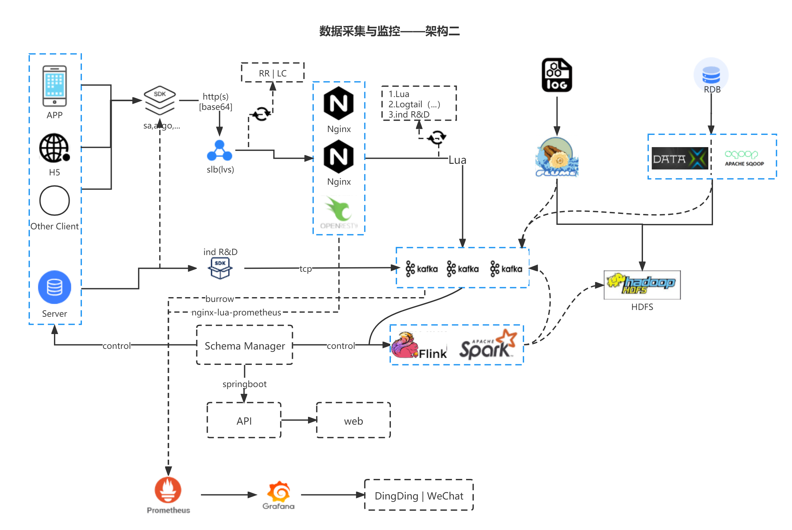

> 数据采集与监控架构二

#### 1.2. 项目组件

本项目中我们的操作系统信息如下：

~~~
* CentOS Linux release 7.6.1810 (Core)  # 操作系统选择Centos7即可
* JDK 1.8
~~~

| 编号 | 组件       | 基础课 | 版本     | 备注                           |
| ---- | ---------- | ------ | -------- | ------------------------------ |
| 1    | OpenResty  |        | 1.15.8.3 | based on the nginx 1.15.8 core |
| 2    | Flume      |        | 1.7.0    |                                |
| 3    | Sqoop      |        | 1.4.7    |                                |
| 4    | DataX      |        | 3.0      |                                |
| 5    | LVS        |        |          |                                |
| 6    | Prometheus |        | 2.17.1   |                                |
| 7    | Grafana    |        | 6.7.3    |                                |
| 8    | Hadoop     |        | 2.7.6    |                                |
| 9    | Hive       |        | 2.1.1    |                                |
| 10   | Azkaban    |        | 3.82.0   |                                |
| 11   | SpringBoot |        | 2.2.0    |                                |

#### 1.3. 架构阐述

本阶段的项目使用上图的架构一进行实施，接下来是对其设计进行阐述，会简单讲解其中的基本概念和在架构中的作用，后续在实施时会进行具体讲解。

##### 1.3.1. 客户端日志收集

之前讲到我们要开发一个HTTP服务，接收客户端上报给来的用户行为日志（HTTP请求），除此之外还要将数据落到磁盘上，这样数据就从客户端保存到服务器的磁盘上，也就是下图的部分：

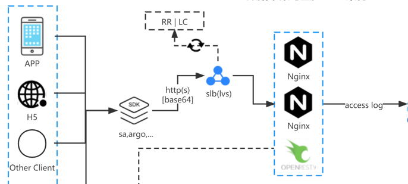

从图中可以看到，我们通过开源的SDK进行埋点（可自行研发）将APP、网页(H5)等客户端的用户日志，通过HTTP请求发送到Nginx集群，这里有几点需求说明：

- 可以看到通过HTTP发送的数据并非直接的明文数据，而是做了`base64`编码，对于`base64`编码

  - 第一，其并非加密算法，而是一种编码方式，所以并不能保证数据的安全，如果想要加密数据可以使用对称加密或非对称加密算法，但这样也就涉及解密，这一过程需要耗费大量计算资源，尤其是海量数据的情况下。现在基本APP数据上报都是`base64`编码，有的APP会使用https相对更安全些。
  - 第二，客户端并不会在用户每次产生行为数据就立刻上报，而是有两个条件控制`时间`和`日志条数`，比如`30s, 100条`这两个条件任何一个达到才触发请求，请求数据时为了减少网络流量我们会将这些数据压缩为二进制，然后转换为`base64`后传输。

- 使用Nginx作为HTTP接口服务，Nginx是一个高性能的web服务器，在环境搭建中也会做一个Nginx的文档。请求通过Nginx的Access日志直接落盘。

  - Nginx可以线性扩展，以应对高并发请求，一般来讲，一台`4C8G的机器`，可以承受`8000-11000的QPS`。多台Nginx我们通过`lvs`来做负载均衡或者云缠上提供的`slb`服务，lvs是为了将流量合理的分配给多台Nginx，分配算法一般是Round Robin(RR)轮询算法，Least Connections(LC)最小连接调度。

    > lvs：整体相比Nginx/HAProxy要更稳定，转发效率也更高。将请求（流量）合理分配给服务器（这里指Nginx），其包含十种调度算法和三种工作模式，供使用者选择。其中常用且容易理解的就是“加权最小连接调度”，在调度新连接时尽可能使服务器的已建立连接数和其权值成比例。
    >
    > slb：商业的（花钱搞定一切），解决lvs的一些痛点，如：跨vlan通讯问题、DDOS攻击防御功能、性能部署扩容等。当然这些也可以在lvs的基础上搞，只是花时间而且没有人兜底。`兜底`≈出问题有人背锅。

- 对于落盘后的数据我们可以通过Flume监听磁盘数据目录，实时收集数据发送到hdfs指定的目录上。我们会做一个定时任务切分Nginx Access日志到指定的磁盘数据目录。Flume监听这个数据目录中的文件，发送完一个文件就删除一个文件。

##### 1.3.2. 新闻&业务数据收集

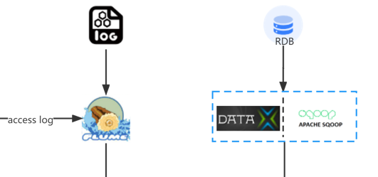

前面讲到，新闻资讯服务端先拉专门数据公司的数据，再通过推的方式给我们，我们可以通过`Flume Http Source`提供HTTP接口给服务端，让他们把数据推给我们，之后直接投递到hdfs上。我们的业务数据在MySQL（RDB关系型数据库）中，只收集广告数据表中的数据，这个数据通过Sqoop或者DataX也可以直接收集，相关MySQL连接信息后面会给出。

##### 1.3.3. 元数据&调度

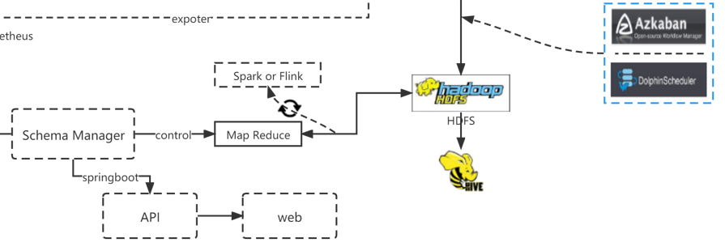

从图中可以看出，我们的数据经过`Flume、Sqoop`发送到hdfs，通过Azkaban调度建立HIVE分区表，注意此表中是json数据，再调度一个json数据转换的宽表，之后我们会有一个MR根据`元数`据信息和我们的数据信息结合做一个数据校验控制。

> 元数据（Metadata）：又称中介数据、中继数据，为描述数据的数据（data about data），主要是描述数据属性（property）的信息，用来支持如指示存储位置、历史数据、资源查找、文件记录等功能。
>
> 这里可以简单理解为对于我们埋点数据json中的字段进行管理，如json中有哪些字段，字段都是什么类型等。实际开发过程中，每埋一个点，都需要在埋点数据管理平台（上图中的web），提交一个申请，比如我要增加一个点击新闻的埋点，这个埋点需要添加什么字段，是什么类型等都要写清楚，经过审核后，客户端伙伴才会开发埋点。这样我们上报的json数据才会有这个字段。
>
> 不用关注埋点数据管理平台如何实现，了解其作用即可。

这样通过元数据和我们上报的数据可以做一个检验，过滤掉客户端再实际操作过程中出现的错误数据，同时对于埋点，我们通过和元数据结合，也可以做到快速下线数据。在本项目中，我们会把元数据也同步到HIVE表，通过SQL Join的方式去做数据校验，而不是写MR。DophonScheduler也是作业流调度系统。

### 四.部署实施

#### 4.1. 数据格式

##### 4.1.1. 行为数据格式

之前我们说过，对于用户行为数据的Scheme我们是有埋点平台的，通过元数据管理控制，在这里我们为了简化，不再去开发元数据管理的WEB平台，而是直接给出元数据的表结构信息，这个表在MySQL中。我们通过已经埋过的点的数据结构，只要开发好HTTP接口，将客户端上报数据的地址，指向开发好的HTTP接口地址，就可以实时收到用户行为数据。

- 配置客户端上报数据的地址，这里的地址就是开发好的HTPP接口地址，使用方式如下

  ~~~shell
  # 例如我们开发好HTTP接口地址为 http://xxx.xxx.xxx/data/v1, 我们需要执行如下命令，将我们开发好的地址配置到管理中心,只要有数据发送到我们的接口中，我们可以在request_body中获取到发送的base64编码数据,在后面的部署中会详细说明
  curl -X POST \
    http://meta.frp.qfbigdata.com:8112/ \
    -F data_url=http://xxx.xxx.xxx/data/v1
  ~~~

  

- 上报数据格式

  ~~~json
  # 原始base64
  eyJjb25ldG50Ijp7ImRpc3RpbmN0X2lkIjoiNjkyNDA3MiIsInByb3BlcnRpZXMiOnsibW9kZWwiOiJIUlktQUwwMGEiLCJuZXR3b3JrX3R5cGUiOiJXSUZJIiwiaXNfY2hhcmdpbmciOiIyIiwiYXBwX3ZlcnNpb24iOiI0LjQuNSIsImVsZW1lbnRfbmFtZSI6IuaIkeeahOmSseWMhemhtSIsImVsZW1lbnRfcGFnZSI6IummlumhtSIsImNhcnJpZXIiOiLkuK3lm73np7vliqgiLCJvcyI6ImFuZHJvaWQiLCJpbWVpIjoiOTM4ZDczMWY0MTg3NGRhMCIsImJhdHRlcnlfbGV2ZWwiOiI2OSIsInNjcmVlbl93aWR0aCI6IjEwODAiLCJkZXZpY2VfaWQiOiJlZDcxZDdkZi0yZjVjLTY2ZDMtY2JmYi01M2Y1NWJjNzg5OTkiLCJjbGllbnRfdGltZSI6IjIwMjAtMDQtMjUwNzo1OTo1MCIsImlwIjoiMTIxLjU2Ljc5LjQiLCJ3aWZpIjoiMSIsIm1hbnVmYWN0dXJlciI6IkhVQVdFSSIsInNjcmVlbl9oZWlnaHQiOiIyMzQwIn0sImV2ZW50IjoiQXBwQ2xpY2sifSwicHJvamVjdCI6Im5ld3MiLCJjdGltZSI6IjE1ODc3NzU3NDUifQo=
  # decode之后的json
  {
  	"conetnt": {
  		"distinct_id": "6924072", # 用户ID
  		"properties": {
  			"model": "HRY-AL00a", #机型
  			"network_type": "WIFI", #用户网络类型
  			"is_charging": "2", #是否充电中
  			"app_version": "4.4.5", #app版本
  			"element_name": "我的钱包页", #元素名称
  			"element_page": "首页", #元素所在页面
  			"carrier": "中国移动", #运营商
  			"os": "android", #操作系统
  			"imei": "938d731f41874da0", #手机IMEI号
  			"battery_level": "69", #手机电量
  			"screen_width": "1080", #屏幕宽度
  			"device_id": "ed71d7df-2f5c-66d3-cbfb-53f55bc78999", #设备ID
  			"client_time": "2020-04-25 07:59:50",#客户端上报此条日志时间
  			"ip": "121.56.79.4", #客户端IP地址
  			"manufacturer": "HUAWEI", #制造商
  			"screen_height": "2340", #屏幕高度
        "client_time":"1587771745000" # 客户端上报日志时间
  		},
  		"event": "AppClick" # 事件名称
  	},
  	"project": "news", #产品名称
  	"ctime": "1587775745000" #服务器接收到日志时间
  }
  ~~~

##### 4.1.2. 业务数据格式

业务数据在MySQL中共两张表，一张是行为数据的元数据表，一张表是广告信息表，结构信息如下

~~~sql
-- 元信息表，已经过简化
CREATE TABLE `meta` (
  `id` int(11) unsigned NOT NULL AUTO_INCREMENT COMMENT '自增ID，主键',
  `field` varchar(50) NOT NULL DEFAULT '' COMMENT '字段名称',
  `filed_type` varchar(20) NOT NULL DEFAULT '' COMMENT '字段类型',
  `field_desc` varchar(255) DEFAULT NULL COMMENT '字段说明',
  `app_version` varchar(10) NOT NULL DEFAULT '' COMMENT '上线版本号',
  `status` tinyint(4) DEFAULT '0' COMMENT '字段状态，0 下线 1 上线',
  `create_time` timestamp NOT NULL DEFAULT CURRENT_TIMESTAMP COMMENT '创建时间',
  `update_time` timestamp NULL DEFAULT NULL ON UPDATE CURRENT_TIMESTAMP COMMENT '更新时间',
  PRIMARY KEY (`id`)
) ENGINE=InnoDB AUTO_INCREMENT=2 DEFAULT CHARSET=utf8mb4;
-- 广告信息表，已经过简化
CREATE TABLE `ad_info` (
  `id` int(11) unsigned NOT NULL AUTO_INCREMENT COMMENT '自增ID，主键',
  `ad_id` int(11) DEFAULT NULL COMMENT '广告ID',
  `advertiser_id` int(11) DEFAULT NULL COMMENT '广告商ID，一个广告商会投放多个广告',
  `advertiser_name` varchar(255) DEFAULT NULL COMMENT '广告商名称',
  `create_time` timestamp NOT NULL DEFAULT CURRENT_TIMESTAMP COMMENT '创建时间',
  `update_time` timestamp NULL DEFAULT NULL ON UPDATE CURRENT_TIMESTAMP COMMENT '更新时间',
  PRIMARY KEY (`id`)
) ENGINE=InnoDB DEFAULT CHARSET=utf8mb4;

~~~

##### 4.1.3. 新闻资讯数据格式

新闻资讯数据服务端会通过我们提供的`Flume HTTP Source`推给我们，格式如下

~~~json
{
	"article_id": 487186016, # 文章ID，新闻的唯一标识
	"type_name": " 科技", #新闻类型
	"pub_time": "2020-04-20 19:45:36.919", # 新闻发布时间
	"title": "小米10pro 30w无线充电对比华为40w有线充电", # 新闻标题
	"content": "
之前做了一个小米10pro 30w无线充电对比华为40w有线充电，米10pro无线充电充满只需要55分钟。							这次oppoACE2，看了其他媒体测试的40w快充，前半小时还比不上米10pro，总时间才快了5分钟。然而一							个40w，一个30w，一个4000毫安，一个4500毫安。。。这40w真的阳痿

", # 新闻内容html格式
	"source_name": "今日头条移动端-数码", # 新闻来源
	"tags": "pro,充电,小时,测试,充满,比不上,需要" # 内容标签
}
~~~

#### 4.2. 采集架构实施

##### 4.2.1. LVS负载均衡

对于负载均衡LVS的环境，因为这部分的内容偏运维，并不是我们大数据课程要掌握的内容，所以在这里我们不搭建这个环节，大家只要知晓工程中我们在高并发场景下，可以使用LVS做负载均衡就可以了。

> 例如：我们用一天机器作为数据收集的机器，但是单台的机器性能是有限的，比如4C8G单台机器只能抗住我们`10000 QPS`，但我们的流量高峰有`15000 QPS`，那我们再加一台机器就可以了。但是这两台机器如何同一对外提供服务呢，我们的目的简单来讲有两点，第一，对外是一个IP提供服务。第二，两台机器要相对均衡分配，每天机器都分到`7500 QPS`。那LVS就可以实现我们的目的，那我们再说一个LVS最简单的流量调度算法，Round Robin Scheduling （RR）轮询算法，就是一次把请求分配给RS(real server)，就是我们的两台机器。LVS有8种调度算法，来满足不同场景的需求，在大数据这门课程中，并不需要我们掌握。另外对于负载均衡（SLB），LVS只是负载均衡的一种实现方式，不要片面的认为LVS就是SLB。

##### 4.2.2. Nginx & Lua 数据埋点接口

> 写在前面的话：我们在本节中使用Lua，并没用使用Lua直接写入Kafka的模型，因为当前Kafka我们还没有学习，这里通过Lua写access日志，对于写Kafka的模式对应前文的架构图而，等学完Kafka后，我们将采用写Kafka的方式

前文框架阐述中我们已经说过，将使用Nginx作为数据采集的HTTP服务，词小节我们会对Nginx及其部署做说明。在LVS小节中我们说过并不搭建LVS环境，因此将直接使用单台Nginx构建我们的数据采集接口。以下是引用[官网]([Welcome to NGINX Wiki! | NGINX](https://www.nginx.com/resources/wiki/))对Nginx的描述

> NGINX is a free, open-source, high-performance HTTP server and reverse proxy, as well as an
> IMAP/POP3 proxy server. NGINX is known for its high performance, stability, rich feature set, simple
> configuration, and low resource consumption.

我们私用时并没有使用官方的原生Nginx，而是使用[OpenResty](https://openresty.org/cn/)，它是就Nginx和LuaJit开发的开源软件，可以让我们在Nginx中直接嵌入Lua代码，使我们可以更加灵活的操控数据。对于Lua在本届中，我们也不会单独讲解，在后面搭建环境时，你可以从代码中看到Lua在其中起到的作用就足够了。

OpenResty安装（**实操**）

> 使用的是4C8G的虚拟机7.6版本，我在腾讯云开的

1. 选择yum安装方式，yum默认会安装openresty源的最新版本，当前版本是1.19.9.1

   ~~~shell
   sudo yum install -y yum-utils
   # 添加openresty yum 源
   sudo yum-config-manager --add-repo https://openresty.org/package/centos/openresty.repo
   # 安装openresty
   sudo yum install -y openresty
   ~~~

   > 使用open+tab键看是否补全，或`whereis openresty`查看是否安装到/usr/bin/下。
   >
   > 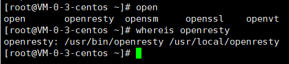
   >
   > 如果是root用户，可以不用sudo，如果非root用户且具有sudo权限，并准备用root权限创建应用，就用sudo。如果责备用个人用户创建，请确保具有相关目录的权限，这里我们使用sudo的权限。

2. yum方式安装后，安装目录在/usr/local/openresty 同时可执行文件在/usr/bin/openresty, 它只是一个软链接如果你的/usr/bin 目录不在系统PATH中，是无法直接执行 openresty 命令的。你需要把/usr/bin 添加到系统环境变量PATH中，[关于OpenResty RPM包的更多介绍](https://openresty.org/cn/rpm-packages.html)，如果指定安装也是可以的，查看源中可用的版本，之后指定一个版本安装即可，这里我们使用默认最新版本

   ~~~shell
   # 查看可用版本
   sudo yum list openresty --showduplicates 
   ~~~

   

3. 为我们的采集服务创建一个OpenResty应用，其实就是创建一个目录，应用相关配置文件都放在这个目录里，方便管理。

   ~~~shell
   # 创建相关目录
   sudo mkdir -p /opt/app/collect-app/
   sudo mkdir -p /opt/app/collect-app/conf/
   sudo mkdir -p /opt/app/collect-app/logs/
   sudo mkdir -p /opt/app/collect-app/conf/vhost/
   sudo cp /usr/local/openresty/nginx/conf/mime.types /opt/app/collect-app/conf/
   ~~~

   > conf目录存储主配置文件
   >
   > logs存储程序运行过程中的日志，用户行为日志
   >
   > vhost放nginx的副配置文件
   >
   > 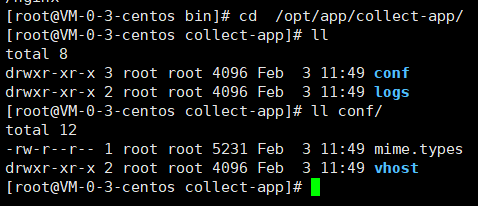

4. 编写nginx配置文件，cd到/opt/app/collect-app/conf/ 目录下，vi/vim命名nginx.conf添加如下内容

   ~~~shell
   # nginx.conf
   # nginx 用户和组
   user    root root;
   # work进程数，
   worker_processes 4;
   # 错误日志路径，和日志级别
   error_log logs/nginx_error.log error;
   # nginx pid文件
   pid       logs/nginx.pid;
   # 单个worker最大打开的文件描述符个数
   worker_rlimit_nofile 65535;
   events
   {
   	#使用epoll模型
   	use epoll;
   	# 单个worker进程允许的最多连接数
   	worker_connections 65535;
   }
   http
   {
   	include mime.types;
   	default_type application/octet-stream;
   	gzip on;
   	gzip_min_length 1k;
   	gzip_buffers 4 16k;
   	gzip_http_version 1.0;
   	gzip_comp_level 2;
   	gzip_types text/plain application/x-javascript text/css application/xml;
   	gzip_vary on;
   	underscores_in_headers on;
   	log_format main
   		'$remote_addr - $remote_user [$time_local] '
   		'$request_length '
   		 '"$request" $status $bytes_sent $body_bytes_sent '
   		'"$http_referer" "$http_user_agent" '
   		'"$gzip_ratio" "$request_time" '
   		'"$upstream_addr" "$upstream_status" "$upstream_response_time"';
   	# 定义我们数据采集的 access 日志格式
   	log_format collect-app '$cad';
   	open_log_file_cache max=1000 inactive=60s;
   	keepalive_timeout 0;
   	client_max_body_size 20m;
   	include /opt/app/collect-app/conf/vhost/*.conf;
   }
   ~~~

   

5. cd到/opt/app/collect-app/conf/vhost/下，编写我们的APP的nginx配置，命名为collect-app.conf。这里说明一下，企业工程中我们一般会把多个应用配置和nginx主配置文件分开，然后在主配置文件中通过include命令包含我们的应用配置，在上方配置最后一行你可以看到include命令。这样做的目的是方便我们管理配置。

   ~~~shell
   #collect-app.conf
   server {
         listen  8802 default_server;
   
         # lua_need_request_body on;
         client_max_body_size 5M;
         client_body_buffer_size 5M;
         location /data/v1 {
             set $cad '';
       			content_by_lua_block {
                 -- cjson模块
                 local cjson = require "cjson"
                 -- 读取请求体信息
                 ngx.req.read_body()
                 -- 请求体信息存放到 body_data变量中
                 local body_data = ngx.req.get_body_data()
                 -- 如果请求体为空，返回错误
                 if body_data == nil  then
                   ngx.say([[{"code":500,"msg":"req body nil"}]])
                   return 
                 end
                 -- 定义当前时间
                 local current_time = ngx.now()*1000
                 -- 请求的URL project参数中获取其值
                 local project = ngx.var.arg_project
                 -- 定义一个字典，存放有当前服务为日志增加的信息，如ctime表示接受到请求的时间，ip地址等
                 local data={}
                 data["project"] = project
                 data["ctime"] = current_time
                 if ngx.var.http_x_forwarded_for == nil then
                   data["ip"] = ngx.var.remote_addr;
                 else
                   data["ip"] = ngx.var.http_x_forwarded_for
                 end
                 -- 将增加的信息编码为json
                 local meta = cjson.encode(data)
                 -- 将编码的json信息做base64 和 body_data拼接
                 local res = ngx.encode_base64(meta) .. "-" .. ngx.unescape_uri(body_data)
                 -- 将数据赋值给我们定义的nginx变量cad中，我们定义的log_format就使用这个变量的值
                 ngx.var.cad = res 
                 ngx.say([[{"code":200,"msg":"ok"}]])
      			}
             access_log  logs/collect-app.access.log  collect-app;
         }
   }
   ~~~

   > 上面的`ccess_log logs/collect-app.access.log collect-app`指定的是相对位置，下面我们再指定前缀

6. 将上述第4，5步中的配置文件，放到对应的目录下后，执行以下命令测试配置文件是否正确，并启动服务

   ~~~shell
   # 测试配置文件格式是否正确，-p指定上面需要的前缀
   sudo openresty -p /opt/app/collect-app/ -t
   # 后台启动
   sudo openresty -p /opt/app/collect-app/
   #如果没有任何输出，代表我们已经成功启动nginx，后面讲解报警服务时，我们会用supervisor来管理nginx服务。
   # 执行下面命令，可以查看到我们的nginx的进程
   ps axu|grep nginx|grep -v grep
   # 也可以通过我们监听的端口号查看到nginx master
   netstat -antp |grep 8802
   ~~~

   > 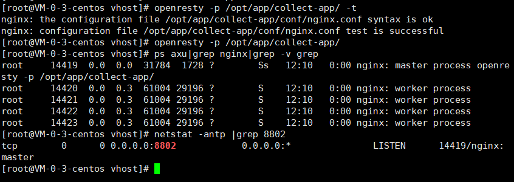

7. Nginx启动后，安装我们的配置，已经在`8802`端口监听请求了，我们数据服务配置的路径是/data/v1，同时我们会解析请求中url的参数project的参数值。接下来我们就测试一下我们接口是否能正常接收数据。我们再来认识一下我们的接口。首先，我们的服务监听`8802`端口，请求的路径是/data/v1，如果客户端有数据请求过来，我们会解析HTTP请求`request_body`中的数据，接收到数据之后和我们自己定义的数据做拼接，日志写入到`collect-app.access.log`文件中，返回给客户端`{"code":200,"msg":"ok"}`。如果一个客户请求的`request_body`为空，我们将在日志中记录空行，返回客户端`{"code":500,"msg":"req body nil"}`。我们接下来通过测试验证我们的接口是否正常。

   ~~~shell
   # 发送一个带request_body的请求，值可以是任意值。 project参数的值，我们定成news，因为我们是新闻的行为数据
   curl localhost:8802/data/v1?project=news -d test_data
   # > return: {"code":200,"msg":"ok"}
   
   # 查看我们记录到的日志
   tail -n 1 /opt/app/collect-app/logs/collect-app.access.log
   # > return: eyJjdGltZSI6MTY0Mzg2MTc3ODg3NiwicHJvamVjdCI6Im5ld3MiLCJpcCI6IjEyNy4wLjAuMSJ9-test_data
   #可以看到我们的数据通过我们定义的"-"做了分隔，第一部分是我们base64后的自定义信息，每个人看到的可能是不一样的，第二部分是刚才HTTP请求体的数据test_data。这些在collect-app.conf文件里local res行定义了
   
   # 我们之前说过客户端发过来的数据也是做了base64的，我们也模拟一下
   echo "test_data"|base64 |xargs -I {} curl localhost:8802/data/v1?project=news -d {}
   # > return: {"code":200,"msg":"ok"}
   tail -n 1 /opt/app/collect-app/logs/collect-app.access.log
   # > return: eyJjdGltZSI6MTY0Mzg2MjA0ODAwNiwicHJvamVjdCI6Im5ld3MiLCJpcCI6IjEyNy4wLjAuMSJ9-dGVzdF9kYXRhCg==
   
   # 可以看到，我们得到了两部分base64数据，他们中间依然以"-"分隔，我们解析出来这两部分数据，验证结果
   # 第一部分
   echo "eyJjdGltZSI6MTY0Mzg2MjA0ODAwNiwicHJvamVjdCI6Im5ld3MiLCJpcCI6IjEyNy4wLjAuMSJ9"|base64 -d
   # > return: {"ctime":1643862048006,"project":"news","ip":"127.0.0.1"}
   # 可以看到，解出来的是我们在nginx lua中自定义的json信息。
   # 第二部分
   echo "dGVzdF9kYXRhCg=="|base64 -d
   # > return test_data
   # 可以看到解析出来是我们的reqest_body中的数据
   
   # 我们再发送一个不带 request_body 的数据
   curl localhost:8802/data/v1?project=news 
   # > return {"code":500,"msg":"req body nil"}
   # 可以看到，如果客户端不带请求体发送请求，我们会给客户端返回错误信息
   ~~~

   > 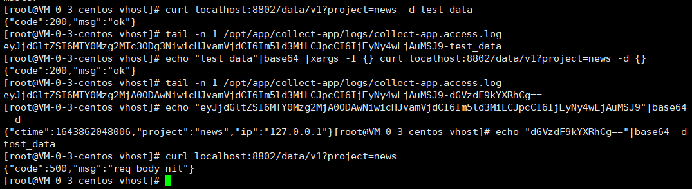

8. 配置接口到管理中心。经过上述步骤，我们的接口就开发完毕了。接下来需要把我们的接口配置到管理中心，这样就可以接收到真实客户端上报的数据了。但由于大家的机器是内网，所以需要先把本机的服务端口，通过内网穿透暴露公网地址，之后配置这个公网地址到管理中心，管理中心通过这个公网给你地址发送数据。这部分内容仅仅是为了让你能够实时的接收到数据，按照下面的方法执行就可以了

~~~shell
# 下载frp 客户端，这个frp是我们自己编译的，已经修改了源码中的默认地址，并做了相关优化，你下载完直接用即可
mkdir -p  /opt/soft/frp/
cd /opt/soft/frp/
wget https://raw.githubusercontent.com/ben1234560/Practical-projects-of-BigData-and-AI/main/soft/frpc_0.33.linux_adm64.tgz 
# 可能需要改名
mv frpc_0.33.linux_adm64.tgz\?raw\=true frpc_0.33.linux_adm64.tgz

tar -xvzf frpc_0.33.linux_adm64.tgz
/opt/soft/frp/frpc http --sd name -l 8802 -s frp.qfbigdata.com:7001 -u name  # 这两个name替换成自己的名字拼音就可以 8802是我们nginx配置的监听端口，注意，name一定要改
~~~

> 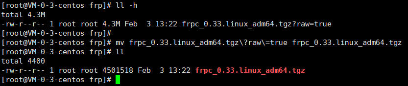
>
> 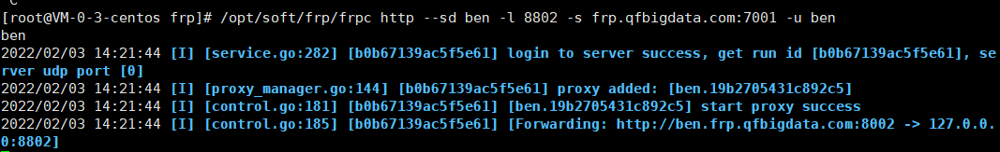
>
> 这个打开后不能停，不小心停了再打开

~~~shell
#运行上述命令后，会看到如上图日志
# 只需要将我们开发的接口主机地址，替换为上述红色圈子中的http连接地址即可，比如上图：
# 我们开发的接口地址是：localhost:8802/data/v1?project=news 
# 替换后的地址是(注意非https) http://name.frp.frp.qfbigdata.com:8002/data/v1?project=news
# 同样可以测试一下新地址是否正常,注意name替换为自己写的名字拼音全拼
curl http://name.frp.qfbigdata.com:8002/data/v1?project=news -d test_data
#> 返回结果{"code":200,"data":true}
~~~

> 新打开一个窗口
>
> 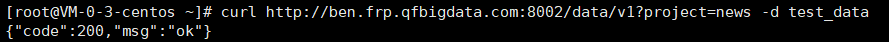

~~~shell
# 接下来把次地址通过命令，配置到管理中心，你只需要把下方命令中 data_url=后面的地址替换成你的地址, name参数的值换成刚刚改的名字
curl -X POST \
  http://meta.frp.qfbigdata.com:8112/api/v1/meta/register \
  -F data_url=http://name.frp.qfbigdata.com:8002/data/v1?project=news \
  -F type=1 \
  -F name=name
# 请求成功后会有如下图返回值
~~~

> 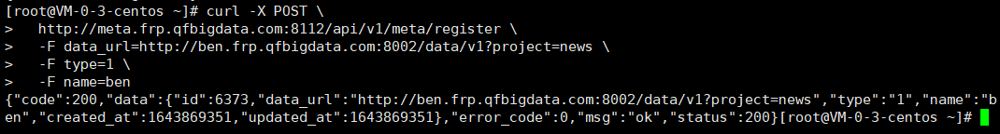
>
> 这时候内网穿透已经完成了

~~~shell
# 如果一切OK，可以去看我们的access日志了，会发现数据正在实时写入到日志文件
tail -f /opt/app/collect-app/logs/collect-app.access.log

# 最后注意，你的frp启动后，如果想要一直接收数据，是不能停止的，一旦停止，就接收不到数据了，再启动就又可以接收到了
~~~

> 文件一直在增大
>
> 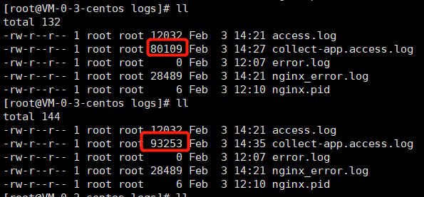
>
> [数据管理中心代码](http://qianfeng.qfjava.cn:8087/bigdata/dmc), 这个是GoLang开发的，有兴趣可以看一下

##### 4.2.3. Flume行为数据收集

我们的日志已经实时的写入到文件了，为了能够通过Hadoop分析这些数据，我们首先要做的就是将数据投递到HDFS上。我们很容易想到Flume就是帮我们做这个事情的。我们需要思考，使用Flume时，`source channel sink`应该如何选择。

1. 首先对于`sink` 因为我们要将数据投递到HDFS上，毋庸置疑我们选择`hdfs sink`。 
2. 对于`channel`, 我们有多种选择，如果速度是第一优先级，同时允许数据再Flume挂掉后有丢失，我们可以选择`Memory Channel`,如果不允许数据丢失，我们可以选择其他可以持久化数据的Channel，比如`File Channel，Kafka Channel` 。对于生成环境中，不同的公司根据其业务会有不同的选择，比如对于用户行为日志，偶尔的丢失数据是可以接受的，因为丢失的数据相对于总体的数据可用忽略不计，也不会因为少量的数据丢失而影响到分析结果，而数据采集的速度和性能我们是比较关注的，因此我们会选择`Memory Channel`。当然很多些企业也会选择`File Channel`，这是个仁者见仁智者见智的事情，`Kafka Channel`我们还没有学习Kakfa，这里先不提。
3. 对于`Source`，因为我们的数据是` access `日志文件，因此我们的Source可以选择`Spooling Directory Source` 和 `Exec Source` 。 我们为什么不使用`Exec Source`,请[参看官网对其解释](https://flume.apache.org/FlumeUserGuide.html#exec-source), 我们使用Spooling Directory Source，先要对我们的access日志做切分处理。接下来我们就开始自己写脚本，切分日志。

先来看一个现象，我们把名字改了

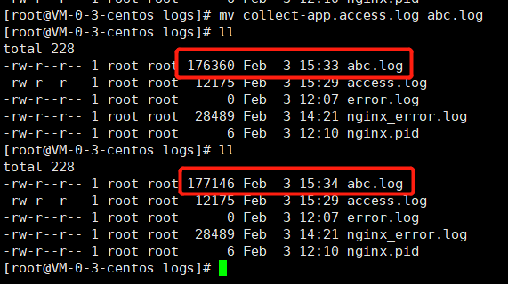

可以看到改了名字后依然在变大，这说明nginx监控到的数据依然在往这里面放，因为nginx追踪的并不是文件名，而是inode唯一标识。即使移动文件也依然在增长。

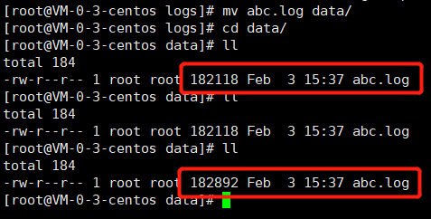

如果想做切分，但数据还是会往相同的inode里写入，所以还需要做一些操作，怎么让它停止对文件的追踪开发新的文件写新的日志，如下操作

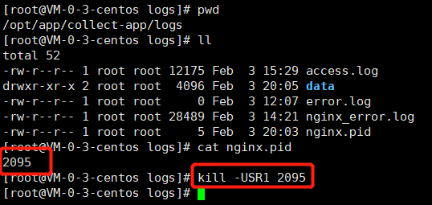

`kill -USR1 2095`kill 掉掉这个id，让nginx产生一个新的文件

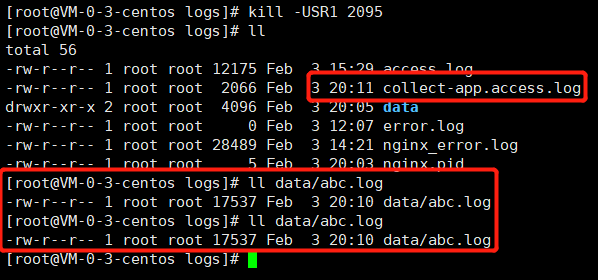

可以看到旧的abc.log不再增加

> 注意，这里我重启了机器，所以文件变小了。重启机器只需要跑这两个命令即可`openresty -p /opt/app/collect-app/`，`/opt/soft/frp/frpc http --sd name -l 8802 -s frp.qfbigdata.com:7001 -u name`注意name要改成之前改的名字

接下来定时执行我们的切分脚本，根据数据量级和对数据实时性的要求，选择切分周期，这里我们选择1分钟切分一次。

~~~shell
# 先创建我们切分后的数据目录
mkdir -p /opt/app/collect-app/logs/data/
# 建立一个目录用来存放我们以后的脚本文件
mkdir -p /opt/scripts/
~~~

cd到/opt/scripts/下，创建split-access-log.sh脚本文件，并添加如下内容

~~~shell
#!/bin/sh
# filename: split-access-log.sh
# desc: 此脚本用于切割Nginx Access日志到指定的目录下，供Flume采集使用
# date: 2020-04-28

# 帮助
usage() {
    echo "Usage:"
    echo "	split-access-log.sh [-f log_file] [-d data_dir] [-p pid_file]"
    echo "Description:"
    echo "	log_file: nginx access file absolute path"
    echo "	data_dir: split data dir"	  
    echo "	pid_file: nginx pid file absolute path"
    echo "Warning: if no parmas, use default value"
    exit -1
}
default(){
	echo  "user default value:"
	echo	"		log_file=/opt/app/collect-app/logs/collect-app.access.log"
	echo	"		data_dir=/opt/app/collect-app/logs/data/"
	echo	"		pid_file=/opt/app/collect-app/logs/nginx.pid"
	# 我们的access日志文件
	log_file="/opt/app/collect-app/logs/collect-app.access.log"
	# 切分后文件所放置的目录
	data_dir="/opt/app/collect-app/logs/data/"
	# Nginx pid 文件
	pid_file="/opt/app/collect-app/logs/nginx.pid"
}

while getopts 'f:d:p:h' OPT; do
    case $OPT in
        f) log_file="$OPTARG";;
        d) data_dir="$OPTARG";;
        p) pid_file="$OPTARG";;
        h) usage;;
        ?) usage;;
        *) usage;;
    esac
done

# 当没有参数传入时
if [ $# -eq 0 ];then
        default                                        
fi

# 重命名access, 注意mv 的过程日志是不会丢失的，因为nginx是以inode来表示数据文件的，而不是文件名，这里mv的操作不会改变inode
if [ ! "${log_file}" ] || [ ! "${data_dir}" ] || [ ! ${pid_file} ]; then
	echo "some parmas is empty，please user  "
	exit -1
fi
# 切分之前，先判断日志文件是否有数据，如果有数据再切分，防止切分出来很多空文件
line=`tail -n 1 ${log_file}`
if [ ! "$line" ];then
	 echo "Warning: access log file no data, do not split!"
	 exit 0
fi 
mv ${log_file} ${data_dir}collect-app.access.$(date +"%s").log
# 向nginx 发送 USR1信号，让其重新打开一个新的日志文件
kill -USR1 `cat ${pid_file}`
echo "finish!"
~~~

> 
>
> 测试下效果
>
> ~~~shell
> sh split-access-log.sh
> ~~~
>
> 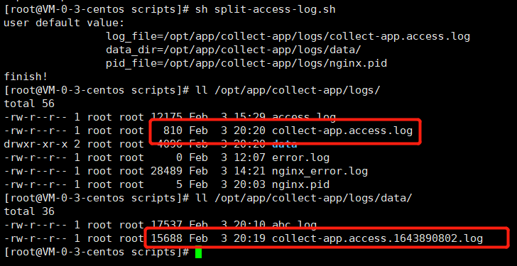
>
> 可以看到上面的红框内容已经变小，被切分到下面的红框内了。

~~~shell
# 建立一个目录用来存放我们以后的脚本执行过程中产生的日志
mkdir -p /opt/scripts/logs
# 写个crontab定时执行文件，一分钟切一次
echo "*/1 * * * *  sh  /opt/scripts/split-access-log.sh >> /opt/scripts/logs/split-access-log.log 2>&1 " > /opt/scripts/collect-app-log.cron
# 添加到定时任务，执行下面命令，linux其实是将你的定时脚本中的内容写到了 /var/spool/cron/root 文件中，这个root就是当前的用户名，因为我这边是以root执行的
crontab /opt/scripts/collect-app-log.cron
# 查看生成的定时任务
crontab -l 
# 1分钟后可以查看我们脚本的执行日志
more /opt/scripts/logs/split-access-log.log 
~~~

> 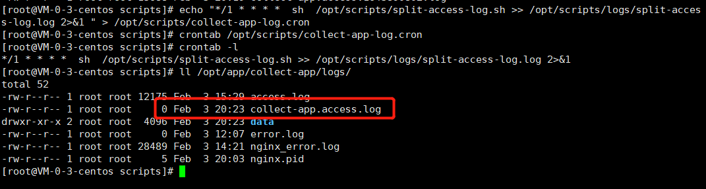
>
> 可以看到红框内的log已经变成0了，因为到一分钟了。

至此我们切分日志的工作就做完了，接下来我们要做就是编写Flume的配置文件，将数据投递到HDFS上了，根据我们前文对于`Source，Channel，Sink` 的选择，在/opt/scripts/下创建collect-app-agent.conf，并添加配置内容

~~~shell
# filename: collect-app-agent.conf
# 定义一个名字为 a1001 的agent
# 定义channel
a1001.channels = ch-1
# 定义source
a1001.sources = src-1
# 定义sink
a1001.sinks = k1

# sink 接到 channel 上
a1001.sinks.k1.channel = ch-1
# source 接到 channel 上
a1001.sources.src-1.channels = ch-1
a1001.sources.src-1.type = spooldir
# 数据文件目录
a1001.sources.src-1.spoolDir = /opt/app/collect-app/logs/data/
# 正则匹配我们需要的数据文件
a1001.sources.src-1.includePattern = ^collect-app.*.log
# 如果想在header信息中加入你传输的文件的文件名，设置下面参数为true，同时设置文件header的key，我们这里设置成fileName，之后你就可以在sink端通过  %{fileName}， 取出header中的fileName变量中的值，这个值就是文件名
# a1001.sources.src-1.basenameHeader = true
# a1001.sources.src-1.basenameHeaderKey = fileName

# 积累多少个event后，一起发到channel， 这个值在生成环境中我们需要根据数据量配置batchSize大的下，通常来讲们的batchSize越大，吞吐就高，但是也要受到 channel 的capacity，transactionCapacity的限制,不能大于channel的transactionCapacity值。 关于这三个参数的区别及说明参看 [官方wiki](https://cwiki.apache.org/confluence/display/FLUME/BatchSize%2C+ChannelCapacity+and+ChannelTransactionCapacity+Properties)
a1001.sources.src-1.batchSize = 100

a1001.sinks.k1.type = hdfs
a1001.sinks.k1.hdfs.path = hdfs://qianfeng01:8020/sources/news/%Y%m%d
a1001.sinks.k1.hdfs.filePrefix = news-%Y%m%d_%H
a1001.sinks.k1.hdfs.fileSuffix = .gz
a1001.sinks.k1.hdfs.codeC = gzip
a1001.sinks.k1.hdfs.useLocalTimeStamp = true
a1001.sinks.k1.hdfs.writeFormat = Text
a1001.sinks.k1.hdfs.fileType = CompressedStream
# 禁用安装event条数来滚动生成文件
a1001.sinks.k1.hdfs.rollCount = 0
# 如果一个文件达到10M滚动
a1001.sinks.k1.hdfs.rollSize = 10485760
# 5分钟滚动生成新文件，和文件大小的滚动一起，那个先达到，执行那个
a1001.sinks.k1.hdfs.rollInterval = 600
# 参加上边连接官网说明，理论上batchSize 越大，吞吐越高。 但是HDFS Sink 调用 Hadoop RPC（包括 open、flush、close ..）超时会抛出异常，如果发生在 flush 数据阶段，部分 event 可能已写入 HDFS，事务回滚后当前 BatchSize 的 event 还会再次写入造成数据重复。 batchSize越大可能重复的数据就越多. 同时batchSize值，不能大于channel的transactionCapacity值
a1001.sinks.k1.hdfs.batchSize = 100
# 每个HDFS SINK 开启多少线程来写文件
a1001.sinks.k1.hdfs.threadsPoolSize = 10
# 如果一个文件超过多长时间没有写入，就自动关闭文件，时间单位是秒
a1001.sinks.k1.hdfs.idleTimeout = 60

a1001.channels.ch-1.type = memory
a1001.channels.ch-1.capacity = 10000
a1001.channels.ch-1.transactionCapacity = 100
~~~

编写一个脚本启动Flume Agent 开始采集数据，在/opt/scripts/下创建start-flume-agent.sh

~~~shell
#!/bin/sh
# filename: start-flume-agent.sh
# desc: 启动采集数据的flume agent,agent 名字为 a1001
# date: 2020-04-28
# 请写你安装的FLUME的路径
FLUME_HOME=/opt/local/flume

${FLUME_HOME}/bin/flume-ng agent -c ${FLUME_HOME}/conf -f /opt/scripts/conf/collect-app-agent.conf -n a1001 -Dflume.root.logger=INFO,console -Dflume.monitoring.type=http -Dflume.monitoring.port=31001
~~~

启动

~~~shell
# 依然把你的脚本放到你之前创建的 /opt/scripts/ 目录下
# 直接执行，程序运行在前台
sh /opt/scripts/start-flume-agent.sh 
# 可以后台执行
nohup sh /opt/scripts/start-flume-agent.sh  >> /opt/scripts/a1001-flume-agent.log 2>&1 &
# 终止进程
ps axu|grep flume|grep collect-app-agent.conf|gawk '{print $2}'|xargs -n1 kill -15
~~~

